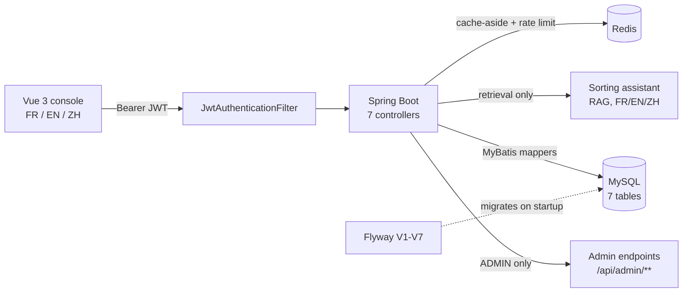

# Blainville Waste Sorting Platform

A trilingual web app for residents of Blainville, Quebec: which bin goes out,
when collection happens, how to sort a given material, and where to drop off
what the curb will not take. Behind it, an admin back office for the schedule,
the sorting guide and public notices.



| Layer | Built with |
|---|---|
| Frontend | Vue 3, TypeScript, Pinia, Vite |
| API | Spring Boot, Java 21 |
| Persistence | MyBatis, MySQL (7 tables), Flyway (7 migrations) |
| Caching | Redis (Spring Cache, cache-aside, optional at runtime) |
| Assistant | Retrieval-augmented Q&A over MySQL full-text; Claude optional |
| Auth | Spring Security, JWT (HMAC), BCrypt |
| Delivery | Docker Compose, GitHub Actions |

## The parts worth reading

**Authentication is enforced by a filter, not by convention.** Register and
login issue a signed token; a custom `JwtAuthenticationFilter` validates every
request through `AppUserDetailsService` before it reaches a controller.
Passwords are BCrypt-hashed. The admin account is seeded from environment
variables, so no one can promote themselves by posting the right JSON.
[`security/`](backend/src/main/java/com/bienvenueblainville/security)

**401 and 403 mean different things here.** An unauthenticated request gets
401 from `HttpStatusEntryPoint`; an authenticated request without the ADMIN
role gets 403 from `AccessDeniedHandlerImpl`. Getting this backwards is easy
and it is exactly the kind of thing the integration suite pins down.

**Redis caches the two reads every page load makes, and the site survives
losing it.** `@Cacheable` fronts the collection schedule and the active
notices; admin writes evict immediately rather than waiting out the TTL. The
cache keys include today's date, because both queries mean "as of today" and
would otherwise serve yesterday's collection after midnight. A `CacheErrorHandler`
turns every Redis failure into a log line and a fall-through to MySQL, and
Lettuce is configured to reject commands while disconnected — without that,
a dead Redis still returned correct data but took 4 seconds per request.
Measured: 603 MySQL `SELECT`s become 1, and killing `redis-server` mid-run
costs 0.01s instead of 4.0s.
[`config/CacheConfig.java`](backend/src/main/java/com/bienvenueblainville/config/CacheConfig.java),
[measurements](docs/verification/redis-cache-results.md)

**The sorting assistant skips generation when retrieval returns no entries.**
It searches the MySQL guide using word indexes for French/English and ngram
indexes for Chinese. The default template quotes the retrieved entry; the
optional Claude composer generates wording with those entries as context.
Nonempty retrieval does not prove relevance or guarantee factual output. The
relative score cutoff always retains the top positive match, even when it is
incidental. `grounded=true` means context was supplied, not that the answer
was independently verified. The recorded 12/12 retrieval and 6/6 refusal
results describe a small development set used while tuning the implementation,
not a held-out accuracy estimate. Claude's live API path remains unverified.
[`assistant/`](backend/src/main/java/com/bienvenueblainville/assistant),
[measurements](docs/verification/assistant-results.md)

**Translation is a table, not a resource bundle.** `sorting_item_translation`
and `sorting_item_keyword` hold the three languages and their search terms, so
an admin can add a material in FR/EN/ZH without a redeploy, and search matches
whichever language the resident actually typed.

**Integration tests boot the real thing.** `AuthenticationFlowIntegrationTest`
starts the full Spring context against a real MySQL and drives it through
MockMvc, exercising the actual filter chain. That is deliberate: the unit tests
mock the collaborators, so they cannot catch a misconfigured filter order, a
context that fails to start, or a 401/403 mix-up. All three of those were real
bugs here, and manual end-to-end verification is what found them.

## It actually runs

Automated tests only assert what someone thought to assert. This project has
also been driven end to end as a live application — local MySQL, the real
Spring Boot backend (`mvn spring-boot:run`), the real Vite frontend
(`npm run dev`) — exercised through `curl` and through a browser.

That session is what caught the six bugs mocked tests structurally could not:
an app that crashed on startup, admin endpoints throwing `ClassCastException`
on every write, and a 401/403 mix-up that would have silently broken
session-expiry handling in the browser. Full transcripts:
[`docs/verification/verification-log.md`](docs/verification/verification-log.md).

The assistant went the same way. It scored 12/12 on retrieval and 5/6 on
refusals before a question about the mayor's phone number came back answered
— with household-waste advice, on the strength of the single French word
`est`. Numbers, transcripts and the fixes:
[`docs/verification/assistant-results.md`](docs/verification/assistant-results.md).

The same approach is how the Redis cache was validated: not "it compiles",
but 603 MySQL queries dropping to 1, and `redis-cli SHUTDOWN` under a live
server to see what actually happens — which is what turned up a 4-second
degraded response time that no test was asserting on.
[`docs/verification/redis-cache-results.md`](docs/verification/redis-cache-results.md).

It also holds up under concurrent load: 50, 100, and 200 simulated residents
registering and loading the home page at once, against the real backend and a
real MySQL instance — 100% success at every level tested, zero failed
requests. Method, numbers, and honest caveats:
[`docs/verification/load-test-results.md`](docs/verification/load-test-results.md).

<table>
<tr>
<td><br />Home — live collection data</td>
<td><br />Sorting guide — live search</td>
</tr>
<tr>
<td><br />Assistant — grounded, with sources</td>
<td><br />Assistant — refusing, and looking like it</td>
</tr>
<tr>
<td><br />Logged in as a resident</td>
<td><br />Admin dashboard — real CRUD data</td>
</tr>
</table>

Every feature — settings, login/registration, and the French/English/Chinese
switch — has its own screenshot alongside the feature it demonstrates in
[`docs/design-notes.md`](docs/design-notes.md#features).

## Tests

53 tests: 34 unit, 19 integration. The September 19 review reran the 34 unit
tests on Java 21; the integration results below were recorded previously.

| Suite | Tests | What it covers |
|---|---|---|
| `AuthServiceTest` | 3 | registration, login, password hashing |
| `JwtServiceTest` | 3 | token issue, parse, rejection |
| `SortingItemServiceTest` | 4 | multilingual search and keyword matching |
| `CollectionServiceTest` | 3 | sector schedule and bin colour resolution |
| `SpecialNoticeServiceTest` | 1 | notice visibility |
| `AuthenticationFlowIntegrationTest` | 7 | full context, real MySQL, real filter chain |
| `RedisCacheIntegrationTest` | 5 | real Redis: cache hits, key scoping, JSON round-trip, eviction |
| `AssistantIntegrationTest` | 7 | real MySQL full-text: grounded answers in FR/EN/ZH, refusals, rate limit |
| `QueryNormalizerTest` | 6 | stopword stripping, accent folding, per-language rules |
| `SortingGuideRetrieverTest` | 4 | relevance cutoff, parser selection, empty-query short circuit |
| `AssistantServiceTest` | 3 | the refusal rule: no context means no model call |
| `TemplateAnswerComposerTest` | 3 | trilingual answer wording |
| `AssistantRateLimiterTest` | 3 | quota boundary, missing counter, Redis failure |
| `ClaudeAnswerComposerTest` | 1 | template provider attribution after API failure |

Unit tests need nothing but the JVM:

```bash
cd backend && mvn test
```

Use Java 21, as in CI and Docker. On macOS, select it with
`export JAVA_HOME=$(/usr/libexec/java_home -v 21)` before running Maven.
The current Mockito dependency does not support the locally installed Java 25.

Integration tests are opt-in locally because they need a database and a Redis
(CI always runs them). With the default `.env.example` values copied into
`.env`, they run against the MySQL and Redis services exposed by Docker
Compose:

```bash
docker compose up -d mysql redis
cd backend && mvn test -Pintegration-test
```

## Running locally

```bash
cp .env.example .env          # set DB_URL, DB_USERNAME, DB_PASSWORD,
                              # APP_JWT_SECRET, APP_ADMIN_EMAIL, APP_ADMIN_PASSWORD
docker compose up -d --build  # MySQL + Redis + backend; Flyway migrates V1-V7
cd frontend && npm ci && npm run dev
```

Frontend on `http://localhost:5173`, API on `http://localhost:8080`.

`CACHE_TYPE=none` disables read caching only. The assistant still requires
Redis for its quota and returns 503 when Redis is unavailable, including in
template mode. Compose still starts Redis with caching disabled.

The quota uses an atomic Redis script and UTC hourly windows. The shared Redis
uses `noeviction` so memory pressure cannot evict quota counters; failed cache
writes fall through while failed quota checks reject assistant requests.
Persistence is disabled locally, so restarting Redis resets quotas. Per-IP
quotas are an abuse deterrent, not a global spending limit: multiple IPs and
hour boundaries can increase usage. Set provider-side spending controls before
exposing the paid provider publicly, and configure trusted proxy handling for
the deployment. API calls have a 15-second timeout and no automatic retries;
fallback responses are labelled `template`.

The resident sorting cards currently come from `frontend/src/data/sortingGuide.ts`,
while the assistant and admin endpoints use MySQL. Admin changes therefore do
not update those static cards. Unifying these data sources is outstanding work.

See [the September 19 review](docs/review-2026-09-19.md) for fixes, remaining
limitations, and the assessment of proposed infrastructure additions.

## More detail

The full design write-up — user scenarios, architecture decisions, the data
model, environment variables, and the deployment notes — is in
[`docs/design-notes.md`](docs/design-notes.md).
