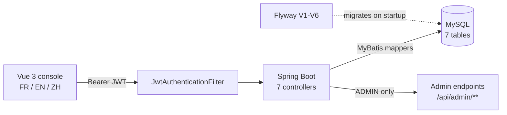

# Blainville Waste Sorting Platform

A trilingual web app for residents of Blainville, Quebec: which bin goes out,
when collection happens, how to sort a given material, and where to drop off
what the curb will not take. Behind it, an admin back office for the schedule,
the sorting guide and public notices.



| Layer | Built with |
|---|---|
| Frontend | Vue 3, TypeScript, Pinia, Vite |
| API | Spring Boot, Java 21 |
| Persistence | MyBatis, MySQL (7 tables), Flyway (6 migrations) |
| Auth | Spring Security, JWT (HMAC), BCrypt |
| Delivery | Docker Compose, GitHub Actions |

## The parts worth reading

**Authentication is enforced by a filter, not by convention.** Register and
login issue a signed token; a custom `JwtAuthenticationFilter` validates every
request through `AppUserDetailsService` before it reaches a controller.
Passwords are BCrypt-hashed. The admin account is seeded from environment
variables, so no one can promote themselves by posting the right JSON.
[`security/`](backend/src/main/java/com/bienvenueblainville/security)

**401 and 403 mean different things here.** An unauthenticated request gets
401 from `HttpStatusEntryPoint`; an authenticated request without the ADMIN
role gets 403 from `AccessDeniedHandlerImpl`. Getting this backwards is easy
and it is exactly the kind of thing the integration suite pins down.

**Translation is a table, not a resource bundle.** `sorting_item_translation`
and `sorting_item_keyword` hold the three languages and their search terms, so
an admin can add a material in FR/EN/ZH without a redeploy, and search matches
whichever language the resident actually typed.

**Integration tests boot the real thing.** `AuthenticationFlowIntegrationTest`
starts the full Spring context against a real MySQL and drives it through
MockMvc, exercising the actual filter chain. That is deliberate: the unit tests
mock the collaborators, so they cannot catch a misconfigured filter order, a
context that fails to start, or a 401/403 mix-up. All three of those were real
bugs here, and manual end-to-end verification is what found them.

## It actually runs

Automated tests only assert what someone thought to assert. This project has
also been driven end to end as a live application — local MySQL, the real
Spring Boot backend (`mvn spring-boot:run`), the real Vite frontend
(`npm run dev`) — exercised through `curl` and through a browser.

That session is what caught the six bugs mocked tests structurally could not:
an app that crashed on startup, admin endpoints throwing `ClassCastException`
on every write, and a 401/403 mix-up that would have silently broken
session-expiry handling in the browser. Full transcripts:
[`docs/verification/verification-log.md`](docs/verification/verification-log.md).

It also holds up under concurrent load: 50, 100, and 200 simulated residents
registering and loading the home page at once, against the real backend and a
real MySQL instance — 100% success at every level tested, zero failed
requests. Method, numbers, and honest caveats:
[`docs/verification/load-test-results.md`](docs/verification/load-test-results.md).

<table>
<tr>
<td><br />Home — live collection data</td>
<td><br />Sorting guide — live search</td>
</tr>
<tr>
<td><br />Logged in as a resident</td>
<td><br />Admin dashboard — real CRUD data</td>
</tr>
</table>

Every feature — settings, login/registration, and the French/English/Chinese
switch — has its own screenshot alongside the feature it demonstrates in
[`docs/design-notes.md`](docs/design-notes.md#features).

## Tests

21 tests: 14 unit, 7 integration.

| Suite | Tests | What it covers |
|---|---|---|
| `AuthServiceTest` | 3 | registration, login, password hashing |
| `JwtServiceTest` | 3 | token issue, parse, rejection |
| `SortingItemServiceTest` | 4 | multilingual search and keyword matching |
| `CollectionServiceTest` | 3 | sector schedule and bin colour resolution |
| `SpecialNoticeServiceTest` | 1 | notice visibility |
| `AuthenticationFlowIntegrationTest` | 7 | full context, real MySQL, real filter chain |

Unit tests need nothing but the JVM:

```bash
cd backend && mvn test
```

Integration tests are opt-in locally because they need a database (CI always
runs them):

```bash
docker compose up -d mysql
cd backend && mvn test -Pintegration-test
```

## Running locally

```bash
cp .env.example .env          # set DB_URL, DB_USERNAME, DB_PASSWORD,
                              # APP_JWT_SECRET, APP_ADMIN_EMAIL, APP_ADMIN_PASSWORD
docker compose up -d          # MySQL + backend; Flyway migrates V1-V6 on startup
cd frontend && npm ci && npm run dev
```

Frontend on `http://localhost:5173`, API on `http://localhost:8080`.

## More detail

The full design write-up — user scenarios, architecture decisions, the data
model, environment variables, and the deployment notes — is in
[`docs/design-notes.md`](docs/design-notes.md).
