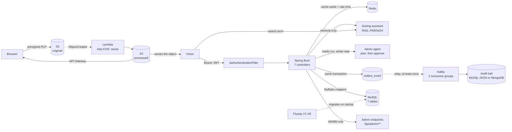
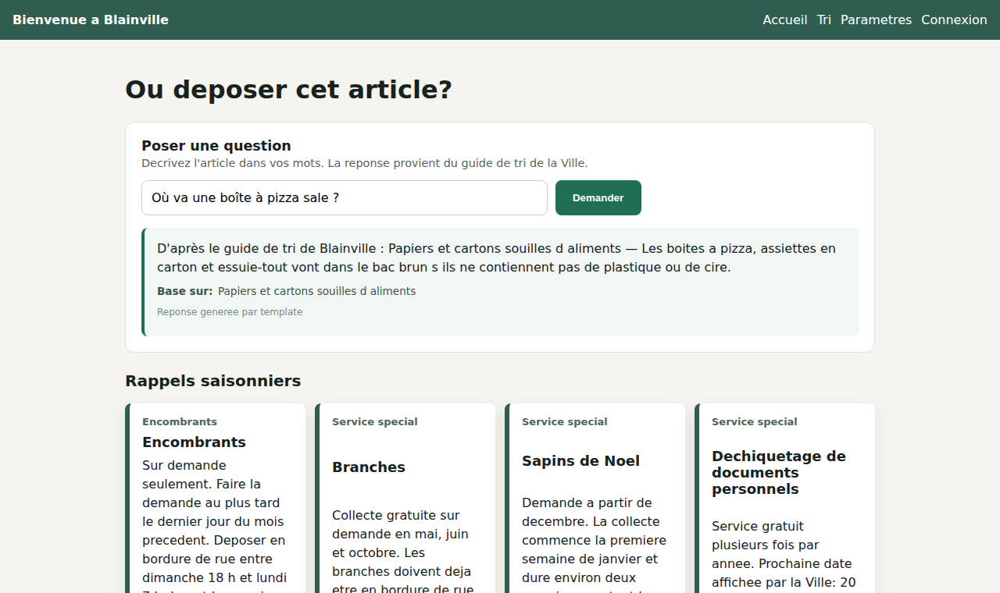
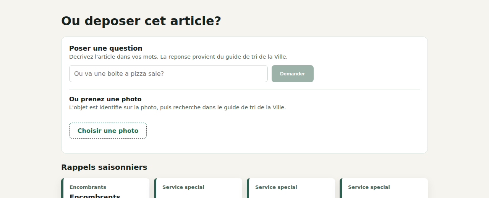
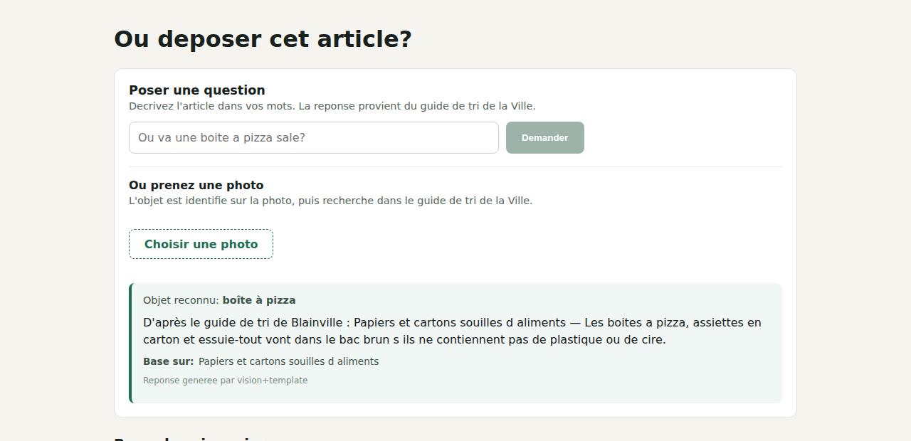
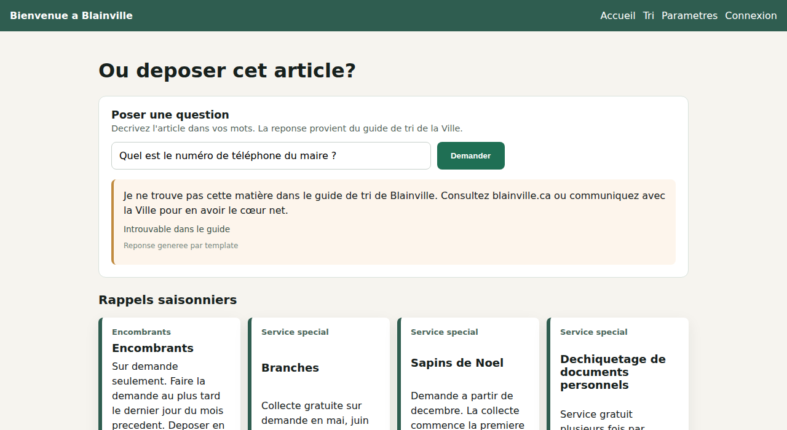
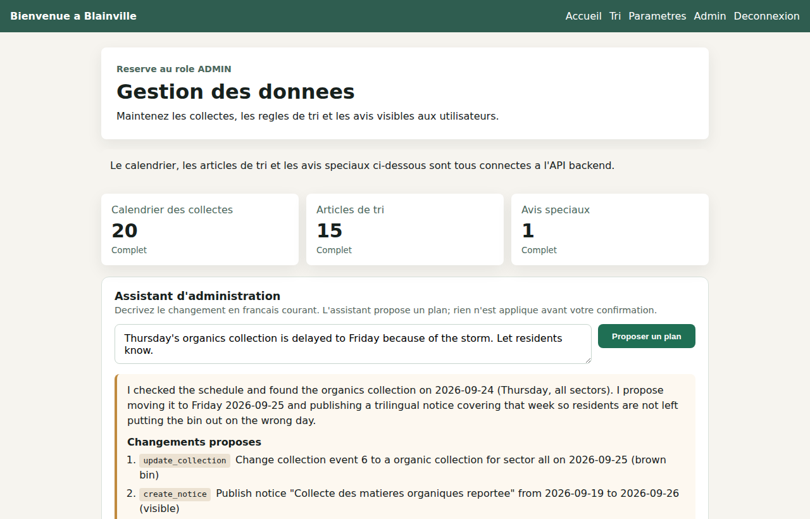
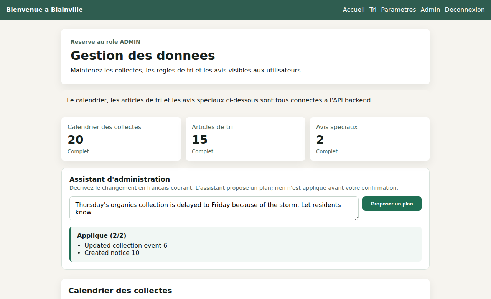

# Blainville Waste Sorting Platform

A trilingual web app for residents of Blainville, Quebec: which bin goes out,
when collection happens, how to sort a given material, and where to drop off
what the curb will not take. Behind it, an admin back office for the schedule,
the sorting guide and public notices.



| Layer | Built with |
|---|---|
| Frontend | Vue 3, TypeScript, Pinia, Vite |
| API | Spring Boot, Java 21 |
| Persistence | MyBatis, MySQL (9 tables), Flyway (8 migrations) |
| Events | Transactional outbox → Kafka, two consumer groups |
| Photos | S3 presigned upload, Lambda (EXIF strip + resize), API Gateway, vision lookup |
| Audit trail | MongoDB or MySQL JSON, same interface and same tests |
| Caching | Redis (Spring Cache, cache-aside, optional at runtime) |
| Assistant | Retrieval-augmented Q&A over MySQL full-text; Claude optional |
| Admin agent | Claude tool-use with a human approval step; plans held in Redis |
| Auth | Spring Security, JWT (HMAC), BCrypt |
| Delivery | Docker Compose, GitHub Actions |

## The parts worth reading

**Authentication is enforced by a filter, not by convention.** Register and
login issue a signed token; a custom `JwtAuthenticationFilter` validates every
request through `AppUserDetailsService` before it reaches a controller.
Passwords are BCrypt-hashed. The admin account is seeded from environment
variables, so no one can promote themselves by posting the right JSON.
[`security/`](backend/src/main/java/com/bienvenueblainville/security)

**401 and 403 mean different things here.** An unauthenticated request gets
401 from `HttpStatusEntryPoint`; an authenticated request without the ADMIN
role gets 403 from `AccessDeniedHandlerImpl`. Getting this backwards is easy
and it is exactly the kind of thing the integration suite pins down.

**Redis caches the two reads every page load makes, and the site survives
losing it.** `@Cacheable` fronts the collection schedule and the active
notices; admin writes evict immediately rather than waiting out the TTL. The
cache keys include today's date, because both queries mean "as of today" and
would otherwise serve yesterday's collection after midnight. A `CacheErrorHandler`
turns every Redis failure into a log line and a fall-through to MySQL, and
Lettuce is configured to reject commands while disconnected — without that,
a dead Redis still returned correct data but took 4 seconds per request.
Measured: 603 MySQL `SELECT`s become 1, and killing `redis-server` mid-run
costs 0.01s instead of 4.0s.
[`config/CacheConfig.java`](backend/src/main/java/com/bienvenueblainville/config/CacheConfig.java),
[measurements](docs/verification/redis-cache-results.md)

**The sorting assistant answers only from the guide, and calls no model when
it finds nothing.** Residents ask in their own words in any of the three
languages; the answer is built from entries retrieved out of the MySQL guide,
and the refusal path never reaches a model at all. Getting retrieval to work
needed two full-text parsers — ngram is the only one that can tokenize
Chinese, and the only one loose enough to make a French refusal impossible —
plus an application-side stopword list, because InnoDB's is English-only and a
stray `est` once made it answer a question about the mayor's phone number with
bin advice.

What that does and does not buy is worth being exact about, because it is easy
to oversell. Non-empty retrieval is not proof of relevance: the relevance
cutoff is relative, so the best positive match always survives it, and
`grounded=true` means context was supplied rather than that the answer was
checked. The 12/12 precision and 6/6 refusal figures come from an 18-question
set that was also used while tuning the stopword list — a development result,
not a held-out estimate. Claude's live API path has never been exercised
against the real API. Claude is optional either way: the default composer
needs no key and costs nothing.
[`assistant/`](backend/src/main/java/com/bienvenueblainville/assistant),
[measurements](docs/verification/assistant-results.md)

**The admin agent proposes; a person approves.** An administrator types
"Thursday's organics are delayed to Friday, tell residents" and gets back a
plan — which rows would change, what the notice would say in all three
languages — and nothing reaches the database until they confirm. The tool loop
is hand-written rather than using the SDK's tool runner, because a tool runner
executes every tool the model calls and cannot express "read the real
schedule, but don't touch it". The line an administrator reads is generated
from the arguments that will actually run, not asked of the model, so it
cannot misrepresent them.
[`agent/`](backend/src/main/java/com/bienvenueblainville/agent),
[what was verified](docs/verification/agent-results.md)

**A photo of the thing, when you don't know what it's called.** The resident
photographs it; a vision model says *what it is*, and the sorting guide says
*which bin* — never the model. A vision model asked "which bin?" answers from
recycling in general, and Blainville is not general: soiled cardboard goes in
the brown bin here and the black bin in plenty of other cities. The response
schema has nowhere to put a bin colour, so that split is structural rather
than a prompt it could drift from, and the photo path inherits the text
assistant's refusal for free.

**Resident photos never pass through the application, and the copy that is
served has no GPS in it.** A phone photo is a few megabytes; accepting it as a
POST means the slowest clients hold a thread the longest. So the browser gets
a presigned URL — with the size, the type and an expiry *signed into it*, not
merely checked before issuing it — and uploads straight to S3. An
`ObjectCreated` event triggers a Lambda that re-encodes the image, which drops
every EXIF segment including the GPS coordinates of whatever curb the resident
was standing on. Only that stripped copy has a route; the original is
unreachable and expires in 7 days. Proven against a real JPEG with a real EXIF
GPS block, not asserted.
[`photo/`](backend/src/main/java/com/bienvenueblainville/photo),
[`infra/template.yaml`](infra/template.yaml),
[what ran and what didn't](docs/verification/photo-pipeline-results.md)

**Events go through an outbox, because publishing from a service method is a
dual write.** Calling Kafka inside `createNotice` means the database commit and
the broker publish can each fail while the other succeeds — residents get told
about a notice that was rolled back, or never told about one that exists, and
retrying cannot fix a failure that lives in the gap between two systems. So the
event row is inserted in the *same MySQL transaction* as the notice, and a
relay moves committed rows to Kafka afterwards. That makes delivery
at-least-once, so both consumers are idempotent on the event id — a single
upsert, not a read-then-write that two replays could race.
[`events/`](backend/src/main/java/com/bienvenueblainville/events),
[what was verified](docs/verification/events-and-audit-results.md)

**The audit trail is implemented twice, and MySQL wins.** `AuditStore` has a
MongoDB implementation and a MySQL-JSON one, and the same contract test runs
against both — that result is the argument. At this scale neither struggles
where the other doesn't, so the trail defaults to the database this app
already runs, and `AUDIT_STORE=mongodb` switches it. What would actually earn
the document store is querying *into* heterogeneous snapshots, or retention
measured in years; neither is true yet.

**Translation is a table, not a resource bundle.** `sorting_item_translation`
and `sorting_item_keyword` hold the three languages and their search terms, so
an admin can add a material in FR/EN/ZH without a redeploy, and search matches
whichever language the resident actually typed.

**Integration tests boot the real thing.** `AuthenticationFlowIntegrationTest`
starts the full Spring context against a real MySQL and drives it through
MockMvc, exercising the actual filter chain. That is deliberate: the unit tests
mock the collaborators, so they cannot catch a misconfigured filter order, a
context that fails to start, or a 401/403 mix-up. All three of those were real
bugs here, and manual end-to-end verification is what found them.

## It actually runs

Automated tests only assert what someone thought to assert. This project has
also been driven end to end as a live application — local MySQL, the real
Spring Boot backend (`mvn spring-boot:run`), the real Vite frontend
(`npm run dev`) — exercised through `curl` and through a browser.

That session is what caught the six bugs mocked tests structurally could not:
an app that crashed on startup, admin endpoints throwing `ClassCastException`
on every write, and a 401/403 mix-up that would have silently broken
session-expiry handling in the browser. Full transcripts:
[`docs/verification/verification-log.md`](docs/verification/verification-log.md).

The admin agent went the same way, and writing its loop test found a bug that
would have broken every write it proposed: `JsonValue.toString()` is a debug
representation, not JSON, so parsing it worked for an empty tool input and
failed the moment a call carried arguments. What ran for real and what was
seeded:
[`docs/verification/agent-results.md`](docs/verification/agent-results.md).

The assistant went the same way. It scored 12/12 on retrieval and 5/6 on
refusals before a question about the mayor's phone number came back answered
— with household-waste advice, on the strength of the single French word
`est`. Numbers, transcripts and the fixes:
[`docs/verification/assistant-results.md`](docs/verification/assistant-results.md).

The same approach is how the Redis cache was validated: not "it compiles",
but 603 MySQL queries dropping to 1, and `redis-cli SHUTDOWN` under a live
server to see what actually happens — which is what turned up a 4-second
degraded response time that no test was asserting on.
[`docs/verification/redis-cache-results.md`](docs/verification/redis-cache-results.md).

It also holds up under concurrent load: 50, 100, and 200 simulated residents
registering and loading the home page at once, against the real backend and a
real MySQL instance — 100% success at every level tested, zero failed
requests. Method, numbers, and honest caveats:
[`docs/verification/load-test-results.md`](docs/verification/load-test-results.md).

<table>
<tr>
<td><br />Home — live collection data</td>
<td><br />Sorting guide — live search</td>
</tr>
<tr>
<td><br />Assistant — grounded, with sources</td>
<td><br />Ask in words, or take a photo</td>
</tr>
<tr>
<td><br />Photo — recognised, then looked up</td>
<td><br />Assistant — refusing, and looking like it</td>
</tr>
<tr>
<td><br />Admin agent — a proposal, not an action</td>
<td><br />After approval — and the counts move</td>
</tr>
<tr>
<td><br />Logged in as a resident</td>
<td><br />Admin dashboard — real CRUD data</td>
</tr>
</table>

Every feature — settings, login/registration, and the French/English/Chinese
switch — has its own screenshot alongside the feature it demonstrates in
[`docs/design-notes.md`](docs/design-notes.md#features).

## Tests

102 tests: 57 unit, 45 integration.

| Suite | Tests | What it covers |
|---|---|---|
| `AuthServiceTest` | 3 | registration, login, password hashing |
| `JwtServiceTest` | 3 | token issue, parse, rejection |
| `SortingItemServiceTest` | 4 | multilingual search and keyword matching |
| `CollectionServiceTest` | 3 | sector schedule and bin colour resolution |
| `SpecialNoticeServiceTest` | 1 | notice visibility |
| `AuthenticationFlowIntegrationTest` | 7 | full context, real MySQL, real filter chain |
| `RedisCacheIntegrationTest` | 5 | real Redis: cache hits, key scoping, JSON round-trip, eviction |
| `AssistantIntegrationTest` | 8 | real MySQL full-text: grounded answers in FR/EN/ZH, refusals, real-Redis quota |
| `AdminAgentIntegrationTest` | 7 | real writes, single-use plans, plan ownership, validation, RBAC |
| `NoticeEventPipelineIntegrationTest` | 5 | outbox commits with the write, relay, two consumer groups, replay safety |
| `PhotoPipelineIntegrationTest` | 7 | real S3: presign, upload, Lambda, prefix isolation, path validation |
| `PhotoProcessorTest` | 5 | EXIF GPS stripped, including when no resize is needed |
| `PhotoSortingServiceTest` | 6 | the model names, the guide decides; refusal when the guide has no entry |
| `AuditStoreIntegrationTest` | 6 | one audit contract, run against MongoDB and MySQL JSON |
| `AdminAgentServiceTest` | 4 | writes recorded not executed, reads executed, turn ceiling |
| `StepSummariserTest` | 4 | the confirmation line, including missing arguments |
| `QueryNormalizerTest` | 6 | stopword stripping, accent folding, per-language rules |
| `SortingGuideRetrieverTest` | 4 | relevance cutoff, parser selection, empty-query short circuit |
| `AssistantServiceTest` | 3 | the refusal rule: no context means no model call |
| `TemplateAnswerComposerTest` | 3 | trilingual answer wording |
| `AssistantRateLimiterTest` | 5 | quota boundary, missing counter, and the failure policy in each mode |
| `ClaudeAnswerComposerTest` | 1 | template provider attribution after API failure |

Unit tests need nothing but the JVM:

```bash
cd backend && mvn test
```

Use Java 21, as in CI and Docker. On macOS, select it with
`export JAVA_HOME=$(/usr/libexec/java_home -v 21)` before running Maven.
The current Mockito dependency does not support the locally installed Java 25.

Integration tests are opt-in locally because they need a database and a Redis
(CI always runs them). With the default `.env.example` values copied into
`.env`, they run against the MySQL and Redis services exposed by Docker
Compose:

```bash
docker compose up -d mysql redis
cd backend && mvn test -Pintegration-test
```

## Running locally

```bash
cp .env.example .env          # set DB_URL, DB_USERNAME, DB_PASSWORD,
                              # APP_JWT_SECRET, APP_ADMIN_EMAIL, APP_ADMIN_PASSWORD
docker compose up -d --build  # MySQL + Redis + Kafka + MongoDB + backend; Flyway V1-V8
cd frontend && npm ci && npm run dev
```

Frontend on `http://localhost:5173`, API on `http://localhost:8080`.

`CACHE_TYPE=none` turns off read caching only; Compose still starts Redis,
because the assistant counts its per-IP quota there. When Redis is
*unreachable*, what happens depends on what is at stake: with Claude
configured, an uncountable quota means uncapped spending, so the assistant
returns 503; with the default template composer nothing is bought per request,
so it serves anyway. The quota itself is enforced in both modes whenever Redis
answers.

Two things that a per-IP quota is not: a global spending limit (many addresses,
many hours) and proxy-aware (it keys on `getRemoteAddr()`, so a reverse proxy
needs a trusted-proxy boundary configured before deployment). Set spending
controls at the provider before exposing a paid composer publicly.

One known inconsistency: the resident sorting cards still render
`frontend/src/data/sortingGuide.ts`, while the assistant and the admin console
read MySQL — so an admin edit does not change those cards. Unifying the two is
outstanding work.

[The September 19 review](docs/review-2026-09-19.md) has the rest: fixes,
remaining limitations, and an assessment of the infrastructure still proposed.

## More detail

The full design write-up — user scenarios, architecture decisions, the data
model, environment variables, and the deployment notes — is in
[`docs/design-notes.md`](docs/design-notes.md).
