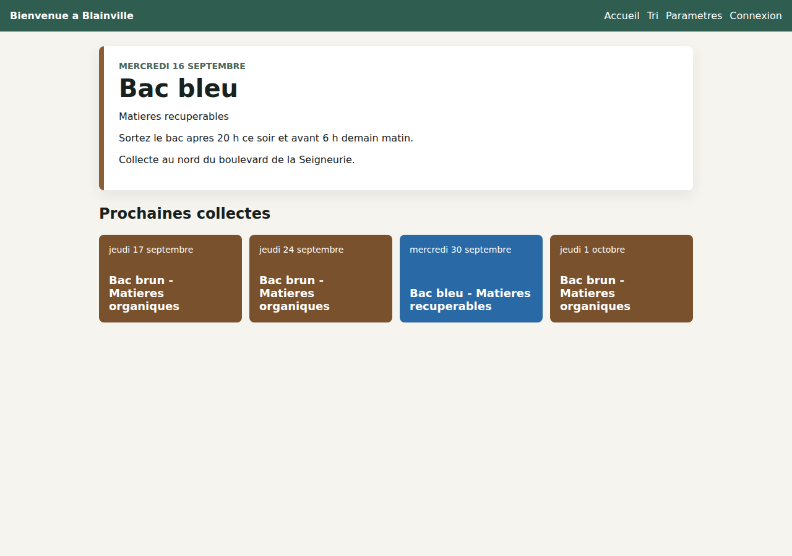
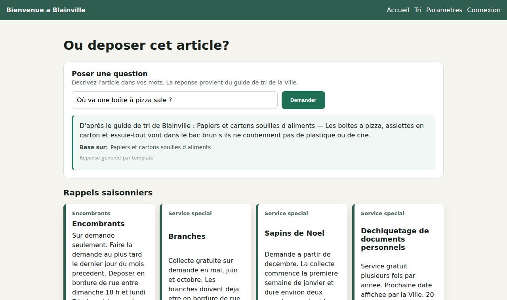
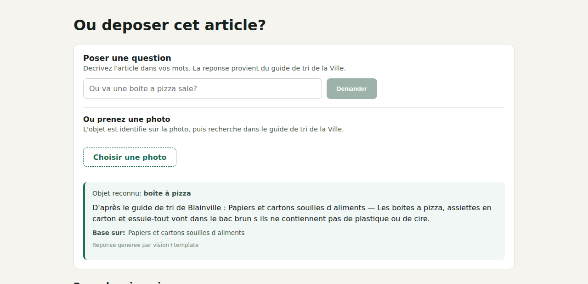
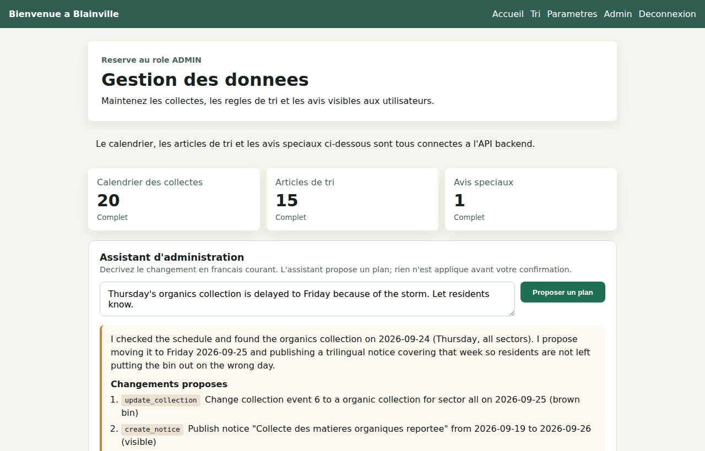
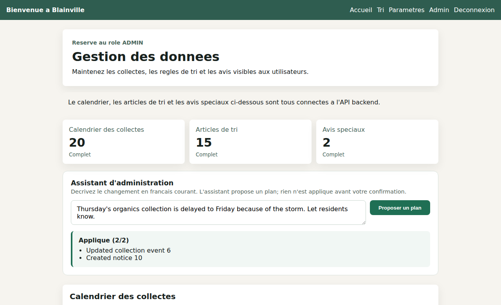

# Blainville Waste Sorting Platform

A website that tells residents of Blainville, Quebec which bin to put out tonight and
where any item belongs.

**Try it: <https://blainville-waste-sorting.onrender.com/>**
(It runs on a free server that sleeps when nobody is using it, so the first visit can take
about a minute to load.)

## The problem

When you move to Blainville, taking out the garbage is surprisingly confusing:

- **Which bin goes out tonight?** It depends on which side of boulevard de la Seigneurie
  you live on, and on the week.
- **Where does this item go?** The rules are local. A greasy pizza box goes in the brown
  (compost) bin here, but in the garbage in many other cities. Batteries and paint go to the
  ecocentre, not in any bin.
- **What about big or seasonal items?** Furniture, branches and Christmas trees each have
  their own pickup dates and sign-up rules.

All of this is spread across several pages of the city's website. Many newcomers end up
watching which bins their neighbours put out. Putting out the wrong bin, or missing a pickup,
means garbage sitting at home for another week or two.

## Who it's for

- **Residents**, especially people who just moved to Blainville.
- **City staff** who need to keep the schedule, the sorting rules and public notices up to
  date.

## What you can do with it

### As a resident

1. **See tonight's bin at a glance.** Choose your side of the city once. The home page then
   shows which bin goes out next, when to put it out (after 8 p.m. the night before) and when
   to bring it back.
2. **Look up any item.** Type "pizza box", "battery" or "old sofa" and get the right bin or
   drop-off location, with instructions. The guide holds all 35 categories the city prints,
   including the ones where the obvious guess is wrong — "compostable" utensils go in the
   garbage, not the brown bin.
3. **Ask in your own words.** Not sure what an item is called? Ask a question like "Where
   does a dirty pizza box go?" The answer shows which part of
   the city's guide it came from, so you can check it.
4. **Take a photo.** If you don't know what to call something, photograph it. The site works
   out what it is, then looks it up in the city's guide.
5. **Get notices.** Holiday delays and special pickups show up on your home page.
6. **Be reminded on your phone.** You can turn on browser notifications for the same
   notices. It is off unless you ask for it, and the notices stay on your home page either
   way, so a blocked notification costs you a buzz rather than the notice.

### As city staff

1. **Keep everything current from one place.** Update the collection calendar, add or fix
   sorting rules, and publish notices, without a developer.
2. **Record a holiday once.** Statutory holidays push collections back by a day or more.
   Staff enter the date and the shift, and every affected pickup moves — including the ones
   already published months ahead — instead of being edited one by one.
3. **Describe a change in one sentence.** For example: "Thursday's compost pickup is moved
   to Friday, tell residents." The AI assistant prepares the calendar change and a notice,
   then waits. Nothing changes until a staff member reviews it and clicks
   approve.
4. **See what residents are asking that the guide doesn't cover.** For example, if many
   people asked about aquariums last month, staff know what to add next.

## Why it works this way

- **The assistant never guesses.** It answers only from the city's own guide. If the guide
  doesn't cover a question, it says so and points at the city's website. A wrong answer about
  garbage is worse than no answer, because the resident acts on it.
- **For photos, the AI only names the object. The city's guide decides the bin.** Blainville's
  rules are not the general recycling rules an AI would otherwise answer from.
- **The AI can't change anything by itself.** Staff see exactly what will change and approve
  it first.
- **The schedule is checked against the city's printed calendar, not against the database it
  was generated from.** That check found two collection patterns labelled recycling where the
  city prints household waste. Every other test had passed.
- **Photos are cleaned before they are stored.** Phone photos carry the GPS location where
  they were taken, often the resident's own home. That location is removed.

## What it achieves

- **Accurate answers.** The assistant answered all 19 questions the city's guide covers and
  declined all 6 it doesn't. One of those questions found a real bug: chicken bones worked in
  English and failed in French.
- **No double changes.** Each approved change is applied exactly once, including when two
  staff members approve the same one at the same moment.
- **Keeps working when something breaks.** If a service behind the site goes down, pages
  still load instead of freezing.
- **Handles busy moments.** 200 residents using the site at once, every request succeeded.
- **Thoroughly tested.** 248 automated tests, many of them against the same kind of setup
  the site runs on in real life.

## About this project

This is a personal portfolio project. It is not an official City of Blainville service, so
always check collection dates on blainville.ca. It was built with AI assistance (Claude Code),
and commits co-written by Claude are marked in the history.

---

**For engineers:** architecture, design decisions, test details and how to run it locally are in
[TECHNICAL.md](TECHNICAL.md). Built with Java 21, Spring Boot, Vue 3 and MySQL.
