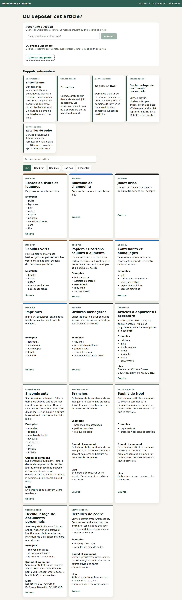

# Deploying this, for nothing

A checklist for putting the application somewhere a stranger can open it,
without a credit card and without a bill.

**Nothing here has been run.** The code changes it depends on have been made
and tested — the allowed CORS origins are configurable, the Lambda jar loads
from a bare classpath, the calendar extends itself — but the deployment
itself has not been performed. Where a step is a verified fact about this
codebase it says so; where it is a fact about a third party, check it,
because free tiers change and this was written in September 2026.

## First: you need far less than the architecture diagram suggests

The application is built so that everything past MySQL is optional at
runtime. For a working public demo:

| Service | Needed? | What happens without it |
|---|---|---|
| **MySQL** | **Required** | Nothing starts. Flyway runs on boot. |
| **Redis** | Strongly recommended | Caching falls through to MySQL; the admin agent's plan hand-off stops working. |
| Kafka | No | `EVENTS_ENABLED=false`. The outbox still records into MySQL, so no event is lost — the relay just does not run. |
| MongoDB | No | `AUDIT_STORE=mysql` (the default) keeps the audit trail in MySQL. The gap report is the only thing that goes dark. |
| S3 + Lambda | No | The photo feature returns errors. Everything else is unaffected. |
| Anthropic key | No | `ASSISTANT_PROVIDER=template` (the default) answers from the guide with no model and no cost. |

So the minimum is **a MySQL and somewhere to run one container.** Two
accounts, not four.

Redis is in the "strongly recommended" row rather than the required one, and
in this configuration it earns even less than that: the cache falls through to
a database that is already fast enough at this size, the assistant's quota
limiter serves anyway because the template provider costs nothing per request,
and the admin agent — the one thing that genuinely needs Redis — is already
unavailable without an Anthropic key. Verified by killing Redis outright and
exercising the app: fourteen guide entries, six upcoming collections, grounded
answers in French and Chinese, and the refusal still refusing.

And there is nowhere separate to serve static files, because the backend
serves them: `Dockerfile` at the repository root builds the frontend and puts
it inside the jar. One deployment, one domain, and CORS stops mattering
because the browser is same-origin.

The photo feature is the one thing that genuinely cannot be free — it needs a
real AWS account with a card on file — so leave it off and say so on the page.

## The services, and what they cost

Checked September 2026. Verify before relying on any of it.

| Piece | Service | Free terms | Card? |
|---|---|---|---|
| MySQL | [Aiven for MySQL](https://aiven.io/free-mysql-database) | 1 GB RAM, 1 GB storage, one free service per type, no time limit | **No** |
| Redis | [Upstash](https://upstash.com/pricing/redis) | 256 MB, 500k commands/month, 10 GB bandwidth | **No** |
| Redis (optional) | [Upstash](https://upstash.com/pricing/redis) | 256 MB, 500k commands/month | **No** |
| The whole app | [Koyeb](https://www.koyeb.com/) | One service, 512 MB RAM, 0.1 vCPU, does not sleep | Usually no — may ask if it cannot verify you are human |
| The whole app (alternative) | [Render](https://render.com/) | Free web service, **sleeps when idle** (cold start on first hit) | No |

**Fly.io is no longer an option.** Its free Hobby allowance was withdrawn;
new accounts get a trial of 2 VM-hours or 7 days and require a card. It is
still in a lot of older tutorials.

Two consequences worth deciding up front:

- **Aiven powers off a free service that sits idle**, with a warning email
  first. For a portfolio link that gets opened once a week, expect to wake it
  up before an interview.
- **Render's free tier sleeps.** First request after idle takes tens of
  seconds — on a JVM, long enough that an interviewer assumes it is broken.
  Koyeb not sleeping is why it is listed first, despite the smaller box.

## MySQL, not Postgres

Not interchangeable here, so do not take the Postgres free tier that every
list recommends. The schema uses MySQL-specific features:

- `FULLTEXT` indexes with **two parsers** — the default word parser for
  French and English, and `ngram` for Chinese. Postgres has no ngram
  full-text parser.
- `on duplicate key update`, which the calendar top-up relies on to be
  repeatable.
- Flyway migrations written in MySQL dialect, including a `STORED GENERATED`
  column.

## Steps

### 1. MySQL

Create the free MySQL service. Take its host, port, database name, user and
password.

The app builds its own JDBC URL from `DB_URL`, so use the whole string:

```
DB_URL=jdbc:mysql://HOST:PORT/DATABASE?useUnicode=true&characterEncoding=utf8&serverTimezone=America/Toronto&sslMode=REQUIRED
```

Managed MySQL normally requires TLS — `sslMode=REQUIRED` is the MySQL
Connector/J parameter for that.

Nothing else to do: **Flyway creates every table and seeds the data on first
boot** (13 migrations, verified to apply cleanly to an empty database).

### 2. Redis — skip it

Set `CACHE_TYPE=none` and move on. The reasoning is under "you need far less
than the architecture diagram suggests" above; it was verified by stopping
Redis rather than by reading the code.

If you do want it later, Upstash requires TLS and a password, and **no code
change is needed** — Spring Boot reads any `spring.*` property from the
environment:

```
REDIS_HOST=<host>
REDIS_PORT=<port>
SPRING_DATA_REDIS_PASSWORD=<password>
SPRING_DATA_REDIS_SSL_ENABLED=true
CACHE_TYPE=redis
```

The Redis timeouts are 500 ms on purpose, so a dead Redis costs milliseconds
rather than seconds. Across the public internet to another provider that is
tight; raise them with `SPRING_DATA_REDIS_TIMEOUT` and
`SPRING_DATA_REDIS_CONNECT_TIMEOUT` if you see warnings.

### 3. The application

Point the platform at this repository with the **`Dockerfile` at the root**
(not `backend/Dockerfile` — the root one builds the frontend too and puts it
inside the jar). Build context is the repository root. No build command to
configure.

**Port.** The application reads `PORT` and defaults to 8080, so a platform
that injects it works with nothing set, and one that asks for a port takes
8080.

**Memory.** The image already sets `JAVA_TOOL_OPTIONS=-XX:MaxRAMPercentage=75`,
because a 512 MB box is small and the JVM's default sizing assumes it is not.

**Health check.** There is no actuator here. Use `GET /api/sorting-items` — it
is public, returns 200, and touches MySQL, so it is a real readiness check
rather than a liveness fiction.

Environment variables:

```
DB_URL=jdbc:mysql://HOST:PORT/DATABASE?useUnicode=true&characterEncoding=utf8&serverTimezone=America/Toronto&sslMode=REQUIRED
DB_USERNAME=...
DB_PASSWORD=...
APP_JWT_SECRET=<a long random string, not the default>
APP_ADMIN_EMAIL=<your admin email>
APP_ADMIN_PASSWORD=<a real password, not the default>
CACHE_TYPE=none                    # no Redis
EVENTS_ENABLED=false               # no Kafka
AUDIT_STORE=mysql                  # no MongoDB
ASSISTANT_PROVIDER=template        # no API key, no cost
```

`APP_JWT_SECRET` and `APP_ADMIN_PASSWORD` have development defaults in
`application.yml`. Deploying without overriding both means shipping a public
admin account with a published password.

`CORS_ALLOWED_ORIGINS` is not in that list on purpose. One deployment means
the browser is same-origin, so nothing is a cross-origin request. It is still
there for a split deployment; it just has nothing to do in this one.

### 4. There is no step 4

The frontend is inside the image. If you would rather host it separately —
a CDN in front of static files is genuinely faster — build it with
`npm run build`, publish `frontend/dist`, and then you do need
`CORS_ALLOWED_ORIGINS` set to that domain, and the API client needs a base URL
instead of the relative paths it uses today. That last part is a code change
this repository has not made.

### 5. Check it

```bash
curl -s https://your-app/api/sorting-items | head -c 80   # a JSON array
curl -s -o /dev/null -w "%{http_code}\n" https://your-app/        # 200, the page itself
curl -s -o /dev/null -w "%{http_code}\n" https://your-app/tri     # 200, history-mode deep link
```

Then open the site, switch the language, and sign in with the admin account.

## What to say about it

Be straight about what is running. Something like:

> Live demo on free-tier infrastructure. The photo feature is disabled
> because it needs a paid AWS account; events and the document store are
> switched off, and the application degrades to MySQL for both by design.

That reads better than a demo where a third of the buttons return errors with
no explanation.

## Costs, plainly

Everything above is $0 with no card, with these exceptions:

- **Photo uploads** need AWS (S3, Lambda, API Gateway). The free tier covers
  this workload comfortably, but AWS requires a card on file and will bill you
  if you exceed it. Left off by default.
- **Claude-worded answers** need an Anthropic API key, which is paid per
  request. The default `template` provider costs nothing and works on a fresh
  clone.
- Koyeb may ask for a card for human verification, which is not the same as
  being charged — but decide whether you mind before starting.

## What the single image looks like

Verified locally before writing any of the above: the frontend built into the
jar, served by Spring Boot, driven with a real browser against one origin —
no Vite proxy, nothing forwarding `/api`.

```text
/                    200  text/html   the page itself
/tri /admin
/connexion
/parametres          200  text/html   history-mode deep links
/assets/*.js .css    200              static assets
/api/sorting-items   200  application/json
/api/admin/notices   401              still protected
/api/nope            401              never HTML
```



*Nineteen cards rendered, no failed requests, no page errors — from
`http://localhost:8080` alone.*

Two things had to change for that to work, and both are the kind that are
obvious afterwards:

- **Spring Security answered 401 to the whole site.** `anyRequest().authenticated()`
  does not distinguish `index.html` from an admin endpoint. The filter chain is
  now scoped with `securityMatcher("/api/**")` — safe because every controller
  in the application is under `/api`, which the commit checked rather than
  assumed.
- **The S3 mock in the tests started binding the application's port.** Adding
  `server.port` to `application.yml` outranked the ports `LocalS3` was passing,
  because `S3MockApplication.start` puts them in Spring's *default* properties.
  They go in as command-line arguments now, which outrank `application.yml`.
