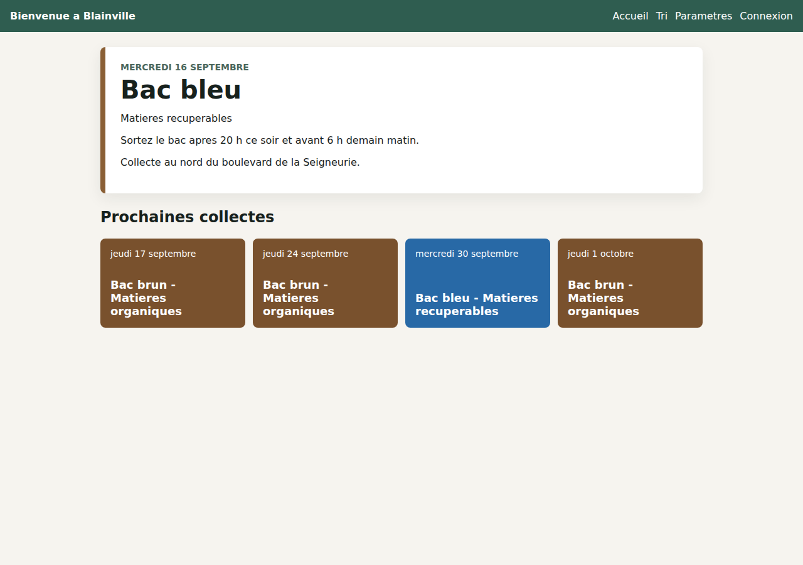
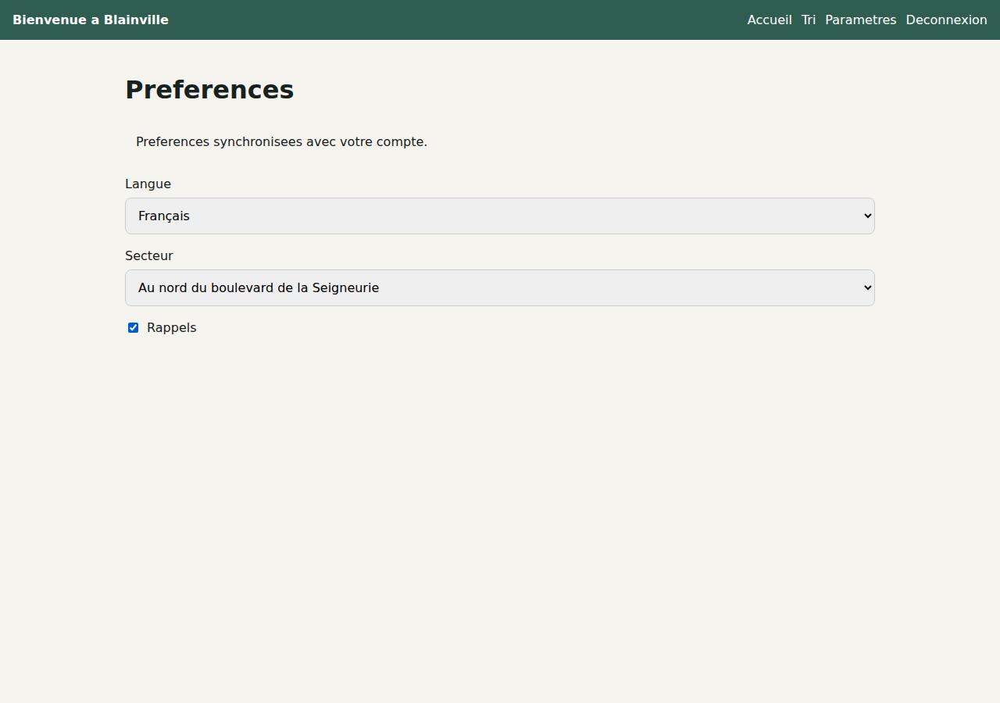
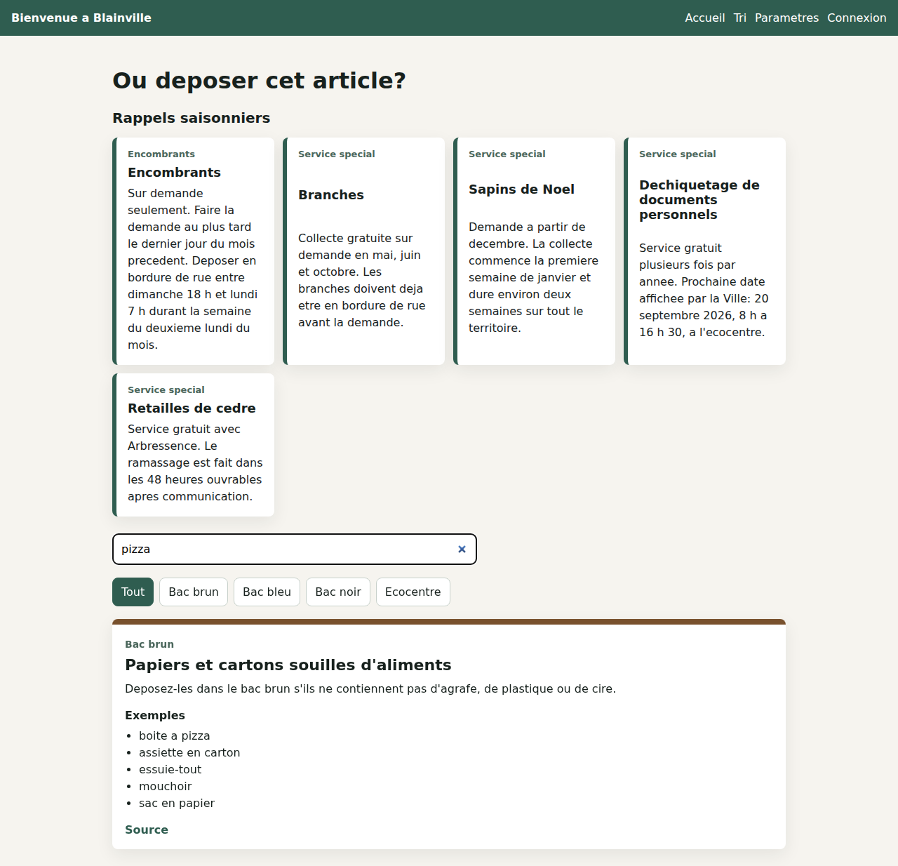
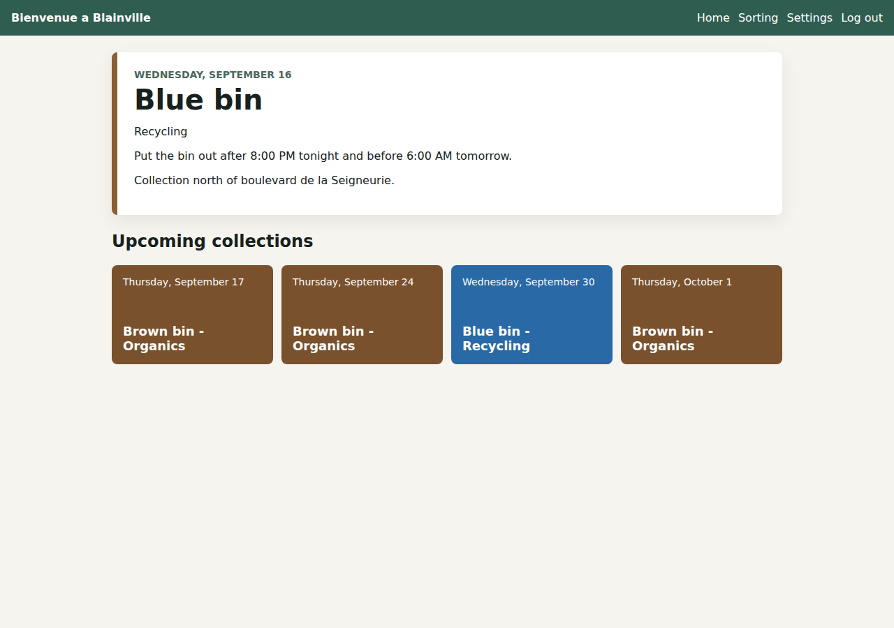
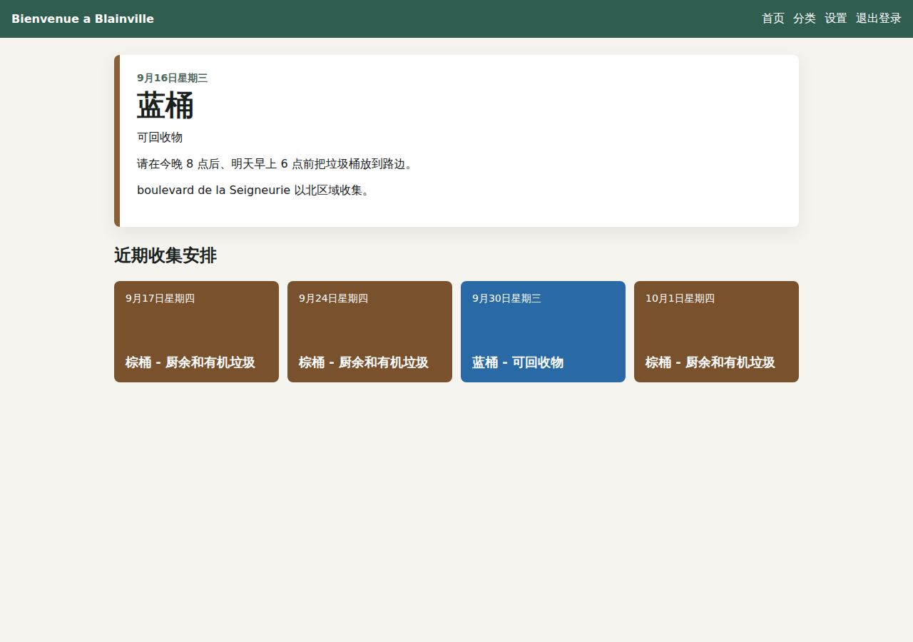
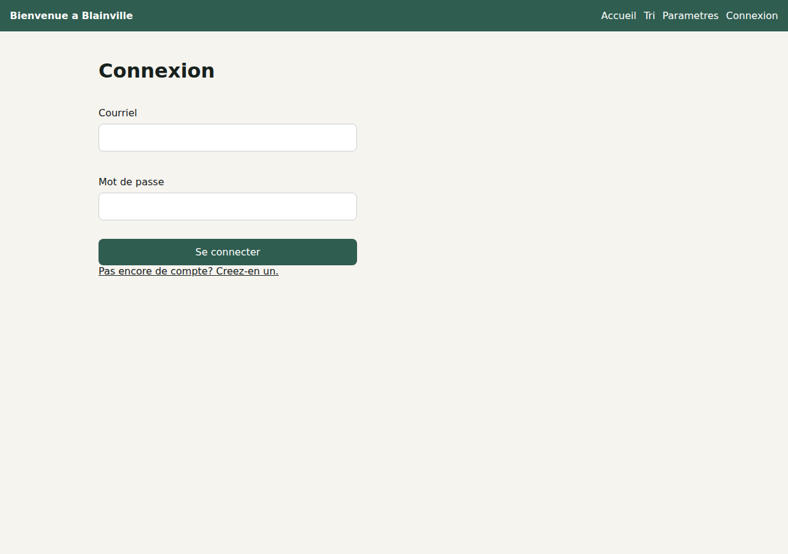
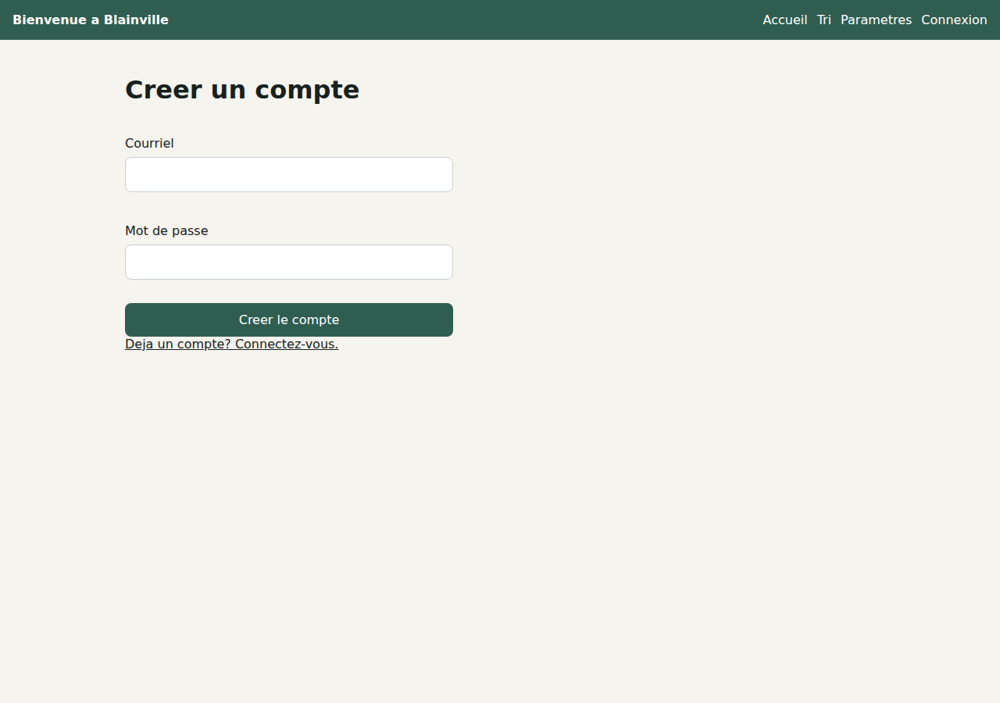
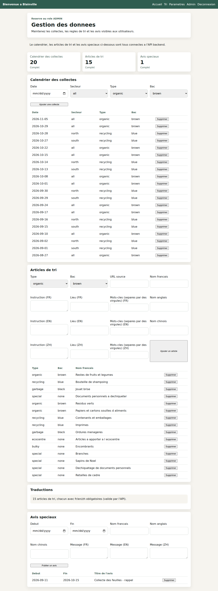

# Blainville Waste Sorting Platform

A full-stack municipal waste sorting and collection reminder web application for residents of Blainville, Quebec.

`Blainville Waste Sorting Platform` helps residents understand which bin to place outside, when collection happens, how common materials should be sorted, and where special items should be dropped off. The application is built with Vue 3, Spring Boot, MyBatis, MySQL, Flyway, Spring Security, and Docker Compose.

The first release is intentionally designed as a web application. Native iOS and Android apps are outside the initial scope.

## Overview

This project turns Blainville's municipal waste collection and sorting information into a resident-friendly web tool. Instead of reading multiple city pages, PDF calendars, and service descriptions, users can open one application and quickly answer practical household questions:

- Which bin should I put outside tonight?
- Is tomorrow a brown, blue, or black bin collection day?
- Does this item belong in the brown bin, blue bin, black bin, or ecocentre?
- When can branches, bulky items, or Christmas trees be placed curbside?
- Where is the ecocentre?
- Is there a special notice or seasonal service I should know about?

The product is French-first because Blainville's municipal context is French. English and Chinese are included as secondary language options to support multilingual residents and newcomers.

## Motivation

New residents often struggle with local waste collection rules. Collection schedules depend on sector, bin color, collection type, and sometimes seasonal or holiday rules. Special services such as bulky item pickup, branch collection, Christmas tree collection, document shredding, and ecocentre drop-off are even harder to understand quickly.

In practice, a new resident may rely on neighbors by checking which bin appears at the curb. This project was created to reduce that uncertainty and make local waste rules easier to follow.

The application focuses on three user needs:

- Make collection timing obvious.
- Make sorting instructions searchable.
- Keep official municipal rules maintainable through structured data.

## Target Users

The application is designed for:

- New residents who recently moved to Blainville.
- Local households that need quick collection reminders.
- Residents who are unfamiliar with municipal sorting rules.
- Multilingual users who prefer English or Chinese guidance in addition to French.
- Admin users responsible for keeping schedules, sorting rules, translations, and notices up to date.

## Core User Scenarios

1. A resident opens the app in the evening and immediately sees whether a bin should be placed outside after 20:00.
2. A user checks the next collection and sees the bin color, collection type, and reminder instructions.
3. A user searches for an item such as a pizza box, battery, paint can, broken toy, or personal documents.
4. The app shows whether the item belongs in the brown bin, blue bin, black bin, ecocentre, bulky pickup, or another special service.
5. A resident checks seasonal rules for branches, Christmas trees, bulky items, cedar trimmings, or document shredding.
6. An admin updates a collection event, adds a sorting entry, edits translations, or publishes a special notice.

## Features

### Collection Reminder

The home page is designed around the most urgent question: what should be placed outside next?

It is intended to show:

- Today's collection status.
- Tomorrow's collection status.
- The next upcoming collection.
- Bin color and collection type.
- When the bin may be placed outside.
- When the empty bin should be brought back.

Blainville's general placement guidance is represented in the app: bins should be placed after 20:00 the evening before collection or before 06:00 on collection day, and empty bins should be brought back before 20:00 on collection day.



*Live data from `GET /api/collections/upcoming` — this is a real running instance, not a mockup.*

### Sector-Based Schedule

Users select whether they live:

- North of boulevard de la Seigneurie.
- South of boulevard de la Seigneurie.

The first version uses manual sector selection instead of postal-code inference. This is simpler, more transparent, and avoids inaccurate assumptions for the MVP.



### Waste Sorting Search

The sorting page supports searchable waste sorting guidance across French, English, and Chinese.

Current categories include:

- Brown bin: food scraps, organic waste, yard waste, and food-soiled paper or cardboard.
- Blue bin: containers, packaging, cardboard, aluminum, plastic bags, and printed paper.
- Black bin: household waste that does not belong in other bins and is refused at the ecocentre.
- Ecocentre: paint, batteries, electronics, tires, aerosols, oils, polystyrene, and other special materials.
- Bulky items.
- Branches.
- Christmas trees.
- Personal document shredding.
- Cedar trimmings.

Each sorting entry can include:

- Destination or service type.
- Bin color.
- Disposal instructions.
- Example materials.
- Seasonal availability.
- Location or address.
- Official source URL.



*A live search for "pizza" — filtering, seasonal reminder cards, and the location field are all visible in this one screenshot (see the next two sections).*

### Seasonal and Special Collection Reminders

The app includes reminders for collection services that do not fit into regular bin pickup.

Examples:

- Bulky items require a request before the last day of the previous month.
- Branch pickup is available by request in May, June, and October.
- Christmas tree pickup requests begin in December, with collection starting in early January.
- Personal document shredding is offered at the ecocentre on specific dates.
- Cedar trimmings are handled through Arbressence.
- Ecocentre-related materials include a drop-off location.

The four cards across the top of the sorting page screenshot above (Encombrants, Branches, Sapins de Noel, Dechiquetage de documents personnels) are exactly these reminders, rendered live from the `special` sorting items in `sorting_item`/`sorting_item_translation`.

### Location and Address Guidance

Sorting entries can include a location field. This is used for records where the user needs to know whether to place an item at the curb, at the edge of the driveway, or bring it to a facility.

Current examples include:

- Ecocentre: `302 rue Omer-DeSerres, Blainville, QC J7C 5N3`.
- Bulky items: curbside in front of the user's residence.
- Branches: curbside on the user's property, with ecocentre drop-off as an alternative.
- Christmas trees: curbside, with ecocentre drop-off as an alternative.
- Personal document shredding: ecocentre.
- Cedar trimmings: edge of the user's driveway, then contact Arbressence.

### Multilingual Interface

The interface is French-first, with English and Chinese support.

The project uses centralized i18n dictionaries so UI text is not hard-coded inside Vue components. This prevents mixed-language screens and keeps translation completeness easier to verify.

Supported interface languages:

- French.
- English.
- Chinese.

<table>
<tr>
<td><br />English</td>
<td><br />Chinese (简体中文)</td>
</tr>
</table>

*Same account, same data, switched entirely — nav labels, dates, bin names, and instructions all change together. Compare against the French home page screenshot further above.*

### User Preferences

The user preference model stores:

- Selected language.
- North or south sector.
- Reminder preference.
- Reminder time.

Preferences are always kept in a Pinia store backed by `localStorage`. When a user is signed in, `GET/PUT /api/preferences` synchronizes the same preferences with the `user_preference` table, so they follow the account across devices. See the Settings screenshot under "Sector-Based Schedule" above.

### User Roles

The application uses two roles:

- `USER`: regular resident account.
- `ADMIN`: administrator account.

There is no guest account mode in the planned product. Users are expected to sign in to save their preferences.

Registration (`POST /api/auth/register`) always creates a `USER` account. A single `ADMIN` account is seeded automatically on backend startup from the `APP_ADMIN_EMAIL` / `APP_ADMIN_PASSWORD` environment variables, so there is no public path to self-assign the `ADMIN` role.

<table>
<tr>
<td><br />Login</td>
<td><br />Registration</td>
</tr>
</table>

### Authentication

Authentication is implemented end to end:

- `POST /api/auth/register` and `POST /api/auth/login` issue a signed JWT (HMAC, via `jjwt`).
- `Spring Security` validates the token on every request through a custom `JwtAuthenticationFilter`, loads the user through `AppUserDetailsService`, and enforces `hasRole("ADMIN")` on `/api/admin/**`.
- The frontend stores the token in an auth Pinia store, attaches it as a `Bearer` header on API calls, and gates the `/admin` route with a navigation guard.


*Logged in through the actual login form above — this is what a resident sees on `/` afterward, with `Log out` now in the nav bar.*

### Admin Dashboard

The admin dashboard maintains:

- Collection schedules.
- Sorting entries.
- Multilingual translations.
- Special notices.
- Locations.

All of these are connected end to end through protected `/api/admin/**` endpoints, enforced by `hasRole("ADMIN")` and backed by MyBatis:

- **Schedule** (`/api/admin/collections/**`) supports create, update, and delete of `collection_event` rows.
- **Sorting items** (`/api/admin/sorting-items/**`) supports create, update, and delete of `sorting_item` rows together with their French/English/Chinese `sorting_item_translation` rows (name, instruction, and location) and per-language `sorting_item_keyword` entries, in one request. The API requires all three languages (`fr`/`en`/`zh`) on every sorting item, so **translations** and **locations** cannot go missing — the admin UI's "Translations" panel now just reports how many sorting items exist, since completeness is enforced by validation rather than tracked separately.
- **Special notices** (`/api/admin/notices/**`) supports create, update, and delete of `special_notice` rows.

The backend `PUT /{id}` endpoints for schedule and sorting items work, but the admin UI only wires up create/list/delete for them so far — there's no edit form in the browser yet, even though the API supports it.



*Logged in as the seeded `ADMIN` account — every number and row here (20 collection events, 15 sorting items, 1 notice) is real data loaded from `/api/admin/**`, not placeholder content.*

## Tech Stack

### Frontend

- Vue 3
- TypeScript
- Vite
- Pinia
- Vue Router

### Backend

- Java 21
- Spring Boot 3
- Spring Security
- MyBatis
- Flyway

### Database

- MySQL

### DevOps and Tooling

- Docker
- Docker Compose
- Maven
- npm

## Architecture

The project uses a separated frontend and backend architecture:

```text
Browser
  |
  v
Vue 3 Single-Page Application
  |
  | HTTP / JSON
  v
Spring Boot REST API
  |
  | MyBatis mapper layer
  v
MySQL Database
```

The local Docker architecture is:

```text
Docker Compose
  |
  |-- mysql    MySQL database container
  |
  |-- backend  Spring Boot API container

Local machine
  |
  |-- frontend Vue/Vite development server
```

In the current development workflow, Docker Compose runs MySQL and the backend. The frontend remains local and is served through Vite for faster UI iteration.

## Architecture Decisions

### Why Vue 3

Vue 3 is lightweight, productive, and well-suited for a mobile-first web interface. It works well for this project because the UI is interaction-heavy but not overly complex: reminders, filters, language switching, settings, sorting cards, and admin forms.

### Why TypeScript

TypeScript improves safety for shared frontend concepts such as language codes, sorting item types, destination types, and user preference state. It helps prevent accidental mismatches in multilingual UI data.

### Why Spring Boot

Spring Boot provides a stable Java backend foundation for REST APIs, validation, security configuration, dependency injection, and database integration. It is a good fit for a project that will grow into authenticated user workflows and admin-managed data.

### Why MyBatis

MyBatis keeps SQL explicit. This is useful for a project where collection schedules, keyword search, translations, and admin filters may require clear and controllable queries. It also matches the intended Java backend learning and development direction.

### Why MySQL

MySQL is sufficient for the project's relational data model and is easy to use with Spring Boot and MyBatis. The core data is naturally relational: users, preferences, collection events, sorting records, translations, keywords, and notices.

### Why Flyway

Flyway makes the database reproducible. Schema changes and seed data are tracked as versioned migrations, so a fresh database can be initialized consistently in local development or Docker.

### Why Docker Compose

Docker Compose reduces setup friction for the backend environment. Instead of requiring every developer to configure MySQL manually, Compose starts a known MySQL version and the Spring Boot backend together.

The frontend is not containerized yet because local Vite development provides faster hot reload and simpler UI work. A production frontend container can be added later.

## Data Model

The database schema is designed around municipal collection data, multilingual sorting records, and user preferences.

Core tables:

```text
app_user
  Stores user accounts, email addresses, password hashes, and roles.

user_preference
  Stores language, sector, and reminder settings for each user.

collection_event
  Stores dated collection events, including sector, collection type, bin color, notes, and source URL.

sorting_item
  Stores the base sorting record and destination type.

sorting_item_translation
  Stores multilingual names, instructions, and locations for each sorting item.

sorting_item_keyword
  Stores searchable keywords by language.

special_notice
  Stores temporary announcements such as holiday changes, service delays, or seasonal notices.
```

Flyway migrations are stored in:

```text
backend/src/main/resources/db/migration/
```

The current migration set (`V1`–`V6`) includes initial schema creation, seed collection data, expanded sorting records, seasonal special collection records, location fields, and an extended collection calendar seed.

## Internationalization

Internationalization is a core product requirement, not an afterthought.

Design goals:

- French is the default language.
- English and Chinese are available as user-selected languages.
- UI text is centralized in message dictionaries.
- Components should not hard-code display copy.
- Sorting records are modeled with translations.
- Keywords are stored per language.
- A language switch should update the full experience, not only part of the page.

This avoids frustrating mixed-language states such as a French title with English instructions and Chinese buttons.

## Admin Workflow

The admin role supports long-term maintenance of municipal information through the protected `/api/admin/**` API:

- Create, update, and delete collection events.
- Add, update, or delete sorting items, each with required French/English/Chinese translations, an optional location per language, and per-language search keywords.
- Publish, update, or delete special notices for holidays, service delays, or temporary municipal programs.
- Store source URLs for traceability on collection events and sorting items.

The admin UI itself currently exposes create/list/delete for schedule and sorting items (no edit form yet, though the API supports it) and full create/update/delete for special notices. Seasonal service rules beyond what's already seeded, and admin validation warnings for missing translations, are not built — see Roadmap.

## Docker Strategy

The project uses a hybrid development strategy:

- Docker Compose runs MySQL and the Spring Boot backend.
- The Vue frontend runs locally with Vite.

This keeps the backend environment reproducible without slowing down frontend development.

Docker services:

```text
mysql
  MySQL 8.4 database container.
  Exposes container port 3306 on host port 3307 by default.
  Stores data in a named Docker volume.

backend
  Spring Boot application container.
  Builds from backend/Dockerfile.
  Connects to the MySQL service through the Docker network.
  Exposes port 8080.
```

The backend waits for MySQL to become healthy before starting. Flyway runs automatically when the backend starts.

## Running Locally

### Prerequisites

Recommended:

- Docker Desktop
- Node.js
- npm

Optional for manual backend execution:

- Java 21
- Maven
- Local MySQL installation

### Option A: Docker Backend Environment

This is the recommended local workflow.

From the project root:

```bash
cp .env.example .env
```

Edit `.env` and replace placeholder values:

```text
DB_PASSWORD=replace_with_a_local_dev_password
MYSQL_ROOT_PASSWORD=replace_with_a_local_root_password
APP_JWT_SECRET=replace_with_a_long_random_development_secret
APP_ADMIN_EMAIL=admin@blainville.local
APP_ADMIN_PASSWORD=replace_with_a_local_dev_admin_password
```

Start MySQL and the backend:

```bash
docker compose up --build
```

Backend URL:

```text
http://localhost:8080
```

Start the frontend in a second terminal:

```bash
cd frontend
npm install
npm run dev
```

Frontend URL:

```text
http://localhost:5173
```

### Option B: Manual Local Backend

Use this if you want to run MySQL and Spring Boot directly on the host machine.

Create the database in MySQL Workbench:

```sql
CREATE DATABASE bienvenue_blainville
  CHARACTER SET utf8mb4
  COLLATE utf8mb4_unicode_ci;
```

Create a dedicated local database user:

```sql
CREATE USER 'blainville_app'@'localhost' IDENTIFIED BY 'your_local_password';
GRANT ALL PRIVILEGES ON bienvenue_blainville.* TO 'blainville_app'@'localhost';
FLUSH PRIVILEGES;
```

Optional, only if you want to run the integration test suite (`mvn test -Pintegration-test`): create a second database for it, so tests never touch your working data.

```sql
CREATE DATABASE bienvenue_blainville_test
  CHARACTER SET utf8mb4
  COLLATE utf8mb4_unicode_ci;
GRANT ALL PRIVILEGES ON bienvenue_blainville_test.* TO 'blainville_app'@'localhost';
FLUSH PRIVILEGES;
```

Start the backend:

```bash
cd backend
DB_PASSWORD='your_local_password' \
APP_JWT_SECRET='a-long-random-development-secret' \
APP_ADMIN_PASSWORD='your_local_admin_password' \
mvn spring-boot:run
```

Start the frontend:

```bash
cd frontend
npm install
npm run dev
```

## Environment Variables

Backend settings are read from environment variables:

```yaml
DB_URL
DB_USERNAME
DB_PASSWORD
APP_JWT_SECRET
APP_ADMIN_EMAIL
APP_ADMIN_PASSWORD
```

`APP_ADMIN_EMAIL` / `APP_ADMIN_PASSWORD` seed the first `ADMIN` account on startup, if no `ADMIN` account exists yet.

The default backend configuration is in:

```text
backend/src/main/resources/application.yml
```

The repository includes:

```text
.env.example
```

The real `.env` file should remain local and should not be committed.

## Commands

Start Docker backend environment:

```bash
docker compose up --build
```

Stop Docker containers:

```bash
docker compose down
```

Stop containers and remove the MySQL volume:

```bash
docker compose down -v
```

Build backend:

```bash
cd backend
mvn -q -DskipTests package
```

Run backend unit tests (fast, no database required):

```bash
cd backend
mvn test
```

Run the full test suite including integration tests (requires a running MySQL matching `DB_URL`/`DB_USERNAME`/`DB_PASSWORD`, and a `bienvenue_blainville_test` database granted to that user — see "Option B: Manual Local Backend" above for creating the user):

```bash
cd backend
mvn test -Pintegration-test
```

Build frontend:

```bash
cd frontend
npm run build
```

Start frontend development server:

```bash
cd frontend
npm run dev
```

Validate Docker Compose configuration:

```bash
docker compose --env-file .env.example config
```

## Current Status

Completed:

- Full-stack project structure with a Vue 3 frontend and a Spring Boot backend.
- Email/password registration and login with JWT authentication (`jjwt`), validated on every request by a custom `JwtAuthenticationFilter`.
- Real `ADMIN` / `USER` authorization: `/api/admin/**` is enforced by Spring Security (`hasRole("ADMIN")`), and a single `ADMIN` account is seeded from environment variables on startup.
- User preference persistence in MySQL (`GET/PUT /api/preferences`), synced with the frontend Pinia store for signed-in users.
- Admin CRUD for collection schedules, sorting items (with required French/English/Chinese translations, locations, and keywords), and special notices, wired end to end from the admin UI through MyBatis to `collection_event`, `sorting_item`/`sorting_item_translation`/`sorting_item_keyword`, and `special_notice`.
- `HomeView` calls `GET /api/collections/upcoming` for the signed-in resident's sector and shows the real next collection (today/tomorrow framing, put-out/bring-back guidance) plus a short list of upcoming collections, instead of static sample data.
- MyBatis mapper foundation and a normalized 7-table MySQL schema.
- Flyway migrations for schema and seed data, including a rolling collection calendar seed (`V6`) so the home page has real upcoming dates to show.
- Static multilingual sorting guide data on the frontend (sorting search is not yet backend-driven — see Limitations).
- Seasonal and special collection reminder data.
- Location and address support for special sorting records.
- French, English, and Chinese i18n foundation, including the auth and admin flows.
- Docker Compose setup for MySQL and backend.
- Backend Dockerfile.
- Environment-variable-based configuration (database, JWT secret, seeded admin credentials).
- Unit tests for the JWT service, auth service, and collection service (`mvn test`).
- Successful backend Maven build.
- Successful frontend Vite production build (including `vue-tsc` type-checking).
- `docker compose --env-file .env.example config` validates the Compose file.
- An opt-in integration test suite (`mvn test -Pintegration-test`) boots the full Spring context — real `SecurityConfig`, real MyBatis mappers, a real MySQL database — and drives it through MockMvc: register/login, RBAC (403 for a resident on `/api/admin/**`, 401 for no/invalid token), notice date-range validation, and full admin CRUD for notices and sorting items.

Planned or in progress:

- Sorting search backed by the `sorting_item` / `sorting_item_translation` / `sorting_item_keyword` tables instead of the static frontend dataset.
- Edit support for existing collection schedule and sorting item admin entries (currently create/list/delete only in the UI — the backend `PUT /{id}` endpoints already support it).
- Complete import of official Blainville sorting records.
- Future-year collection calendar import.
- PWA manifest and service worker.
- Optional production frontend container.
- Deployment configuration.
- Run the integration test suite in CI against a containerized MySQL (e.g. Testcontainers), instead of requiring a developer-provisioned local database.

## Live Verification

Automated tests are necessary but not sufficient — they only assert what someone thought to write an assertion for. So beyond `mvn test` and `mvn test -Pintegration-test`, this project has also been driven end to end as a running application: a local MySQL instance, the real Spring Boot backend (`mvn spring-boot:run`), and the real Vite frontend (`npm run dev`), exercised through both `curl` and an actual browser (Playwright driving Chromium against the live frontend, which itself calls the live backend).

That session is what caught six real bugs that unit tests, which mock away the Spring context, the security filter chain, and the database, structurally could not have caught — including an app that crashed on startup, admin endpoints that threw `ClassCastException` on every write, and a 401/403 mix-up that would have silently broken session-expiry handling in the browser. The full writeup, with sanitized request/response transcripts, is in [`verification/verification-log.md`](verification/verification-log.md).

Every screenshot from that session is embedded inline under the feature it demonstrates in the Features section above, rather than collected in a single gallery here.

### Can it handle 50+ concurrent users?

Tested rather than guessed: [`verification/load_test.py`](verification/load_test.py) fires N concurrent virtual users at the real backend + real MySQL, each one registering and loading the home page — registration deliberately chosen as the worst case, since it's the one request that pays both BCrypt's cost and a database write. Full methodology and caveats in [`verification/load-test-results.md`](verification/load-test-results.md).

| Concurrent users | Success rate | Register latency (avg / p95) | Home-load latency (avg / p95) |
|---:|---:|---|---|
| 50  | 50/50 (100%)   | 1439 / 1574 ms | 231 / 329 ms |
| 100 | 100/100 (100%) | 2353 / 2976 ms | 117 / 462 ms |
| 200 | 200/200 (100%) | 4392 / 5724 ms | 594 / 2264 ms |

Zero failed requests up to 200 simultaneous registrations, on an untuned single-machine dev setup (Spring Boot's default 10-connection HikariCP pool, no caching, no load balancer). So: **yes, for 50 real concurrent users this held up without errors in testing** — see the linked results for what this test does and doesn't prove before treating it as a production capacity guarantee.

## Security Notes

The project is still in local development. Security-sensitive areas should be completed before production use.

Current security practices:

- Real database passwords and admin credentials should not be committed.
- `.env.example` contains placeholders only.
- Runtime secrets (JWT signing key, seeded admin password) are passed through environment variables.
- Passwords are hashed with BCrypt (`spring-security-crypto`); plaintext passwords are never stored.
- Admin endpoints under `/api/admin/**` are protected by Spring Security and require a JWT for an account with the `ADMIN` role.
- Public registration always creates a `USER` account; the `ADMIN` account is seeded server-side only.
- CORS is restricted to the local Vite dev origin (`http://localhost:5173`).
- Missing or invalid credentials return `401 Unauthorized`; a valid, authenticated request lacking the `ADMIN` role returns `403 Forbidden` — a custom `AuthenticationEntryPoint`/`AccessDeniedHandler` pair keeps these distinct (Spring Security's default collapses both to 403), and `/error` is explicitly `permitAll()` so the internal error-page forward that follows `sendError()` doesn't get reauthenticated as an anonymous request and overwrite the intended status.
- All admin write endpoints use MyBatis parameterized queries (`#{...}` bindings), not string-concatenated SQL, so user-supplied text is never interpreted as SQL.

Production requirements:

- Replace development secrets, including `APP_JWT_SECRET` and `APP_ADMIN_PASSWORD`.
- Use HTTPS.
- Restrict CORS to the production frontend origin.
- Add rate limiting on `/api/auth/**` to reduce brute-force and registration abuse risk.
- Review all official municipal data before public release.

## Official Sources

Initial seed data and rules are based on Blainville municipal resources:

- https://blainville.ca/services/environnement-et-voirie/collectes-et-matieres-residuelles
- https://blainville.ca/services/environnement-et-voirie/matieres-organiques
- https://blainville.ca/services/environnement-et-voirie/matieres-recuperables
- https://blainville.ca/services/environnement-et-voirie/ordures-menageres
- https://blainville.ca/services/environnement-et-voirie/ecocentre
- https://blainville.ca/services/environnement-et-voirie/encombrants

## Limitations

This project is not an official municipal website.

Current limitations:

- The sorting data is an initial structured seed, not a complete official import, and it is still served from a static frontend dataset rather than the `sorting_item` tables.
- The collection calendar seed (`V6__extend_collection_calendar_seed.sql`) is an illustrative recurring pattern covering September–October 2026, not the full official yearly calendar; it will need periodic extension (or a real calendar import) to keep showing upcoming dates.
- The admin UI's schedule and sorting item panels only wire up create/list/delete — the backend `PUT /{id}` endpoints support full updates, but there's no edit form in the browser yet.
- The integration test suite requires a developer-provisioned local MySQL matching `DB_URL`/`DB_USERNAME`/`DB_PASSWORD`; it isn't wired into CI yet and doesn't use an ephemeral/containerized database.
- Push notifications are not implemented.
- The frontend is not yet containerized for production deployment.
- All municipal rules should be verified against official Blainville sources before public use.

## Roadmap

Short-term:

- Move sorting guide data into the `sorting_item` tables and expose a search API, replacing the static frontend dataset.
- Add an edit form to the admin schedule and sorting item panels (the backend `PUT /{id}` endpoints already support it).
- Wire the integration test suite into CI against a containerized MySQL (e.g. Testcontainers) instead of a developer-provisioned local database.

Medium-term:

- Complete the Blainville sorting guide dataset.
- Import full yearly collection calendars.
- Add holiday and service-delay notices.
- Improve admin validation for missing translations.
- Add PWA support for installation on mobile devices.

Long-term:

- Add browser notification support where practical.
- Add optional postal-code or address-based sector detection.
- Add production frontend containerization.
- Deploy the full application.

## Engineering Highlights

- Full-stack municipal service application with a clear resident-facing use case.
- Frontend/backend separation with Vue 3 and Spring Boot.
- Explicit MyBatis data access layer for transparent SQL control.
- Normalized MySQL schema for schedules, sorting records, translations, keywords, notices, and user preferences.
- Flyway-managed database migrations for reproducible schema setup.
- French-first multilingual interface with English and Chinese support.
- Docker Compose environment for reproducible MySQL and backend startup.
- Admin-oriented data model designed for long-term maintenance of municipal rules.

## Project Positioning

`Blainville Waste Sorting Platform` is a resident-facing helper tool. It is designed to make official municipal information easier to search and understand, but it does not replace Blainville's official website.

Before public deployment, all collection dates, sorting rules, locations, and service instructions should be reviewed against official municipal sources and maintained through the admin workflow.
