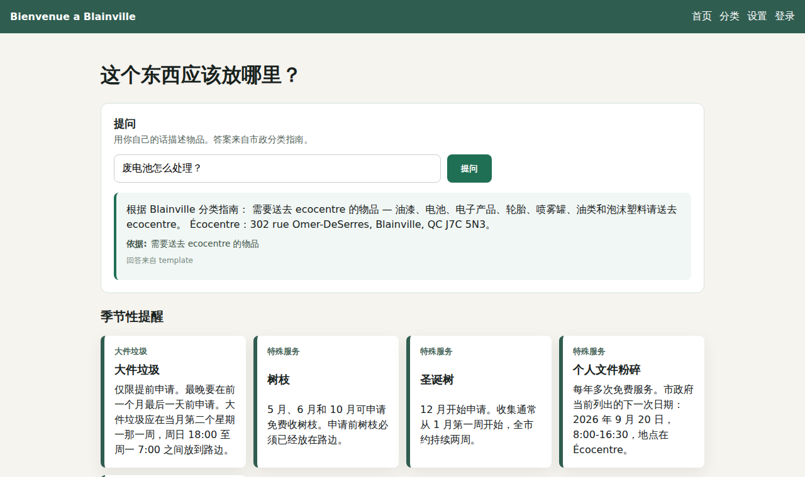
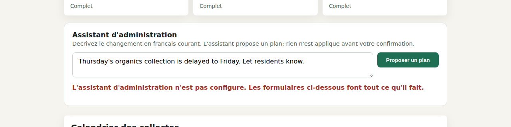

# Blainville Waste Sorting Platform

A full-stack municipal waste sorting and collection reminder web application for residents of Blainville, Quebec.

`Blainville Waste Sorting Platform` helps residents understand which bin to place outside, when collection happens, how common materials should be sorted, and where special items should be dropped off. The application is built with Vue 3, Spring Boot, MyBatis, MySQL, Flyway, Spring Security, and Docker Compose.

The first release is intentionally designed as a web application. Native iOS and Android apps are outside the initial scope.

## Overview

This project turns Blainville's municipal waste collection and sorting information into a resident-friendly web tool. Instead of reading multiple city pages, PDF calendars, and service descriptions, users can open one application and quickly answer practical household questions:

- Which bin should I put outside tonight?
- Is tomorrow a brown, blue, or black bin collection day?
- Does this item belong in the brown bin, blue bin, black bin, or ecocentre?
- When can branches, bulky items, or Christmas trees be placed curbside?
- Where is the ecocentre?
- Is there a special notice or seasonal service I should know about?

The product is French-first because Blainville's municipal context is French. English and Chinese are included as secondary language options to support multilingual residents and newcomers.

## Motivation

New residents often struggle with local waste collection rules. Collection schedules depend on sector, bin color, collection type, and sometimes seasonal or holiday rules. Special services such as bulky item pickup, branch collection, Christmas tree collection, document shredding, and ecocentre drop-off are even harder to understand quickly.

In practice, a new resident may rely on neighbors by checking which bin appears at the curb. This project was created to reduce that uncertainty and make local waste rules easier to follow.

The application focuses on three user needs:

- Make collection timing obvious.
- Make sorting instructions searchable.
- Keep official municipal rules maintainable through structured data.

## Target Users

The application is designed for:

- New residents who recently moved to Blainville.
- Local households that need quick collection reminders.
- Residents who are unfamiliar with municipal sorting rules.
- Multilingual users who prefer English or Chinese guidance in addition to French.
- Admin users responsible for keeping schedules, sorting rules, translations, and notices up to date.

## Core User Scenarios

1. A resident opens the app in the evening and immediately sees whether a bin should be placed outside after 20:00.
2. A user checks the next collection and sees the bin color, collection type, and reminder instructions.
3. A user searches for an item such as a pizza box, battery, paint can, broken toy, or personal documents.
4. The app shows whether the item belongs in the brown bin, blue bin, black bin, ecocentre, bulky pickup, or another special service.
5. A resident checks seasonal rules for branches, Christmas trees, bulky items, cedar trimmings, or document shredding.
6. An admin updates a collection event, adds a sorting entry, edits translations, or publishes a special notice.

## Features

### Collection Reminder

The home page is designed around the most urgent question: what should be placed outside next?

It is intended to show:

- Today's collection status.
- Tomorrow's collection status.
- The next upcoming collection.
- Bin color and collection type.
- When the bin may be placed outside.
- When the empty bin should be brought back.

Blainville's general placement guidance is represented in the app: bins should be placed after 20:00 the evening before collection or before 06:00 on collection day, and empty bins should be brought back before 20:00 on collection day.


*Live data from `GET /api/collections/upcoming` — this is a real running instance, not a mockup.*

### Sector-Based Schedule

Users select whether they live:

- North of boulevard de la Seigneurie.
- South of boulevard de la Seigneurie.

The first version uses manual sector selection instead of postal-code inference. This is simpler, more transparent, and avoids inaccurate assumptions for the MVP.


### Waste Sorting Search

The sorting page supports searchable waste sorting guidance across French, English, and Chinese.

Current categories include:

- Brown bin: food scraps, organic waste, yard waste, and food-soiled paper or cardboard.
- Blue bin: containers, packaging, cardboard, aluminum, plastic bags, and printed paper.
- Black bin: household waste that does not belong in other bins and is refused at the ecocentre.
- Ecocentre: paint, batteries, electronics, tires, aerosols, oils, polystyrene, and other special materials.
- Bulky items.
- Branches.
- Christmas trees.
- Personal document shredding.
- Cedar trimmings.

Each sorting entry can include:

- Destination or service type.
- Bin color.
- Disposal instructions.
- Example materials.
- Seasonal availability.
- Location or address.
- Official source URL.


*A live search for "pizza" — filtering, seasonal reminder cards, and the location field are all visible in this one screenshot (see the next two sections).*

### Sorting Assistant (Ask a Question)

Above the search grid, residents can ask in their own words instead of guessing the word the guide uses. The question goes to `POST /api/assistant/ask`, which searches the sorting guide in MySQL, and the answer is composed **only** from what that search returned.

The entries behind each answer are shown, not tucked away: an answer a resident cannot trace back to the municipal guide is worth less than one they can check, and showing sources makes a bad retrieval obvious rather than invisible.


*"Où va une boîte à pizza sale ?" — answered from the soiled-paper-and-cardboard entry, with that entry named underneath.*

When the guide has nothing relevant, the assistant says so, and the refusal is styled differently from an answer so it cannot be mistaken for one at a glance.


*A question the sorting guide cannot answer. Earlier in development this exact question came back answered — see "Does the assistant make things up?" below.*

The same assistant works in Chinese, which needs a different full-text parser to work at all:



*"废电池怎么处理？" — routed to the ecocentre entry, with its address.*

### Photo Question (Take a Picture Instead)

Some things a resident cannot name. A photo is often the only way they can ask, so the sorting page offers a camera alongside the text box.

The pipeline behind it is the project's AWS surface, and it exists for this feature rather than the other way round. The browser asks for a presigned URL and uploads **straight to S3** - a phone photo is several megabytes, and accepting it as a POST would make the slowest connections hold a request thread the longest. An `ObjectCreated` event triggers a **Lambda** that re-encodes the image, which drops every EXIF segment, including the GPS coordinates of whatever curb the resident was standing on. **API Gateway** serves the stripped copy directly from the bucket; the original has no route at all and expires after seven days.

Then the part that makes it an answer rather than a file upload: the processed copy goes to a vision model that is asked **what the object is**, and that name is fed into the same retrieval a typed question uses.


*Ask in words, or photograph it.*


*Recognised as "boîte à pizza", then answered from the guide entry - the provider line reads `vision+template`, which is the two-stage design made visible.*

**The model names the object; the guide decides the bin.** This is the same rule the text assistant follows and it matters more here, not less: a vision model asked "which bin?" answers from recycling in general, and Blainville is not general - soiled cardboard goes in the brown bin here and the black bin in plenty of other municipalities. The response schema has nowhere to put a bin colour, so the constraint is structural rather than a prompt the model might drift from, and the photo path inherits the refusal too: an object the guide does not cover produces "I recognised an aquarium, but that is not in the guide", not a guess.

### Admin Agent (Propose, then Approve)

In the admin console, an administrator can describe a change in plain language instead of filling several forms. The agent reads the live schedule, then comes back with a plan. Nothing reaches the database until the **Confirmer et appliquer** button is pressed.


*One sentence in; two proposed changes out. The amber panel is deliberately not the colour of a completed action — at this point nothing has happened.*


*After approval. The notice count in the summary cards moved from 1 to 2 — those reload from the API, so that number is the write showing up through a separate code path.*

Without an API key the agent says so, and points at the forms that do the same job:



### Seasonal and Special Collection Reminders

The app includes reminders for collection services that do not fit into regular bin pickup.

Examples:

- Bulky items require a request before the last day of the previous month.
- Branch pickup is available by request in May, June, and October.
- Christmas tree pickup requests begin in December, with collection starting in early January.
- Personal document shredding is offered at the ecocentre on specific dates.
- Cedar trimmings are handled through Arbressence.
- Ecocentre-related materials include a drop-off location.

The four cards across the top of the sorting page screenshot above (Encombrants, Branches, Sapins de Noel, Dechiquetage de documents personnels) are exactly these reminders, rendered live from the `special` sorting items in `sorting_item`/`sorting_item_translation`.

### Notice Inbox

When an administrator publishes a notice, it does not only appear on the
public page: every resident who has reminders switched on gets a row in their
inbox, and the home page shows the unread ones.

The fan-out does not happen in the request that publishes the notice. The
event is written to `outbox_event` in the same transaction as the notice, a
relay drains it to Kafka, and the inbox consumer does the fan-out as a single
`insert ignore ... select` over `user_preference`. If the broker is down the
notice still publishes and the event waits on the table; if the event is
delivered twice, the second fan-out inserts nothing.

### Question Gap Report

Every question a resident asks - typed or from a photo - is logged
anonymously through the same Kafka topic into MongoDB: the language, the
search terms, and whether the guide had an answer. No IP, no account, no
question text tied to a person.

`GET /api/admin/insights/gaps` then answers the question an administrator
actually has: *which things are residents asking about that the guide cannot answer
yet?* That is an aggregation over the terms that produced a refusal, and it
turns "we should expand the sorting guide" into a ranked list of what to add
first. Answers served from the cache are counted too - they are the questions
being asked most, and leaving them out would hide exactly the wrong ones.

### Location and Address Guidance

Sorting entries can include a location field. This is used for records where the user needs to know whether to place an item at the curb, at the edge of the driveway, or bring it to a facility.

Current examples include:

- Ecocentre: `302 rue Omer-DeSerres, Blainville, QC J7C 5N3`.
- Bulky items: curbside in front of the user's residence.
- Branches: curbside on the user's property, with ecocentre drop-off as an alternative.
- Christmas trees: curbside, with ecocentre drop-off as an alternative.
- Personal document shredding: ecocentre.
- Cedar trimmings: edge of the user's driveway, then contact Arbressence.

### Multilingual Interface

The interface is French-first, with English and Chinese support.

The project uses centralized i18n dictionaries so UI text is not hard-coded inside Vue components. This prevents mixed-language screens and keeps translation completeness easier to verify.

Supported interface languages:

- French.
- English.
- Chinese.

<table>
<tr>
<td><br />English</td>
<td><br />Chinese (简体中文)</td>
</tr>
</table>

*Same account, same data, switched entirely — nav labels, dates, bin names, and instructions all change together. Compare against the French home page screenshot further above.*

### User Preferences

The user preference model stores:

- Selected language.
- North or south sector.
- Reminder preference.
- Reminder time.

Preferences are always kept in a Pinia store backed by `localStorage`. When a user is signed in, `GET/PUT /api/preferences` synchronizes the same preferences with the `user_preference` table, so they follow the account across devices. See the Settings screenshot under "Sector-Based Schedule" above.

### User Roles

The application uses two roles:

- `USER`: regular resident account.
- `ADMIN`: administrator account.

There is no guest account mode in the planned product. Users are expected to sign in to save their preferences.

Registration (`POST /api/auth/register`) always creates a `USER` account. A single `ADMIN` account is seeded automatically on backend startup from the `APP_ADMIN_EMAIL` / `APP_ADMIN_PASSWORD` environment variables, so there is no public path to self-assign the `ADMIN` role.

<table>
<tr>
<td><br />Login</td>
<td><br />Registration</td>
</tr>
</table>

### Authentication

Authentication is implemented end to end:

- `POST /api/auth/register` and `POST /api/auth/login` issue a signed JWT (HMAC, via `jjwt`).
- `Spring Security` validates the token on every request through a custom `JwtAuthenticationFilter`, loads the user through `AppUserDetailsService`, and enforces `hasRole("ADMIN")` on `/api/admin/**`.
- The frontend stores the token in an auth Pinia store, attaches it as a `Bearer` header on API calls, and gates the `/admin` route with a navigation guard.


*Logged in through the actual login form above — this is what a resident sees on `/` afterward, with `Log out` now in the nav bar.*

### Admin Dashboard

The admin dashboard maintains:

- Collection schedules.
- Sorting entries.
- Multilingual translations.
- Special notices.
- Locations.

All of these are connected end to end through protected `/api/admin/**` endpoints, enforced by `hasRole("ADMIN")` and backed by MyBatis:

- **Schedule** (`/api/admin/collections/**`) supports create, update, and delete of `collection_event` rows.
- **Sorting items** (`/api/admin/sorting-items/**`) supports create, update, and delete of `sorting_item` rows together with their French/English/Chinese `sorting_item_translation` rows (name, instruction, and location) and per-language `sorting_item_keyword` entries, in one request. The API requires all three languages (`fr`/`en`/`zh`) on every sorting item, so **translations** and **locations** cannot go missing — the admin UI's "Translations" panel now just reports how many sorting items exist, since completeness is enforced by validation rather than tracked separately.
- **Special notices** (`/api/admin/notices/**`) supports create, update, and delete of `special_notice` rows.

All three panels now edit as well as create: clicking **Modifier** on a row
loads it into the panel's own form, which becomes a save form until it is
submitted or cancelled. There is no second form to keep in sync with the first.

The fields that carry the most risk here are the ones added by `V10`/`V11` -
the per-language examples under a sorting card and its seasonal availability.
A form that did not load and resend them would blank them on the first edit,
which is precisely the split those migrations existed to end, so the sorting
form carries all five fields per language and the schedule form carries the
trilingual note and source URL that the generated calendar rows arrive with.


*Logged in as the seeded `ADMIN` account — every number and row here (20 collection events, 15 sorting items, 1 notice) is real data loaded from `/api/admin/**`, not placeholder content.*

## Tech Stack

### Frontend

- Vue 3
- TypeScript
- Vite
- Pinia
- Vue Router

### Backend

- Java 21
- Spring Boot 3
- Spring Security
- MyBatis
- Flyway

### Database

- MySQL

### Caching

- Redis 7 (via Spring Cache / Lettuce), for the two hot public reads, the
  assistant's per-IP quota, the admin agent's pending plans, and the answer
  cache that stops the same question being paid for twice

### Events

- Kafka, fed by a transactional outbox rather than by the request thread
- Two consumer groups on one topic: the resident inbox and the audit trail

### Document store

- MongoDB, for the audit trail and for resident query analytics - aggregation
  pipelines and a TTL index, neither of which MySQL does as naturally

### Assistant

- Retrieval-augmented Q&A over MySQL full-text search (two parsers: word for French/English, ngram for Chinese)
- Anthropic Java SDK, optional - a no-API-key composer is the default

### Admin agent

- Claude tool use over the existing admin services, with a hand-written loop
- Proposed changes held in Redis until an administrator approves them

### Photos and cloud services

- S3 presigned uploads, so image bytes never pass through the application
- Lambda for EXIF stripping and resizing, triggered by S3 object creation
- API Gateway serving the processed copy straight from the bucket
- Vision identification feeding the existing sorting-guide retrieval

### DevOps and Tooling

- Docker
- Docker Compose
- Maven
- npm

## Architecture

The project uses a separated frontend and backend architecture:

```text
Browser
  |
  |  photo bytes go straight to S3 on a presigned URL,
  |  never through the application
  |
  v
Vue 3 Single-Page Application
  |
  | HTTP / JSON
  v
Spring Boot REST API
  |
  |-- MyBatis mapper layer -----> MySQL          schedules, sorting guide,
  |                                              users, notices, outbox
  |
  |-- Spring Cache (Lettuce) ---> Redis          hot reads, assistant quota,
  |                                              agent plans, answer cache
  |
  |-- outbox relay -------------> Kafka: blainville.notice.events
  |     (drains outbox_event)         |-> inbox consumer -> MySQL
  |                                   `-> audit consumer -> MongoDB
  |
  |-- query publisher ----------> Kafka: blainville.resident.queries
  |     (fire and forget)             `-> query-log consumer -> MongoDB
  |
  `-- AWS SDK ------------------> S3
                                    `-> Lambda: strip EXIF, resize
                                        -> processed copy, served
                                           through API Gateway
```

Everything past MySQL is optional at runtime and degrades rather than fails: a
dead Redis falls through to the database, `EVENTS_ENABLED=false` leaves events
on the outbox table instead of losing them, and the audit trail has a MySQL
implementation behind the same interface as the MongoDB one.

The local Docker architecture is:

```text
Docker Compose
  |
  |-- mysql    MySQL database container
  |
  |-- backend  Spring Boot API container

Local machine
  |
  |-- frontend Vue/Vite development server
```

In the current development workflow, Docker Compose runs MySQL and the backend. The frontend remains local and is served through Vite for faster UI iteration.

## Architecture Decisions

### Why Vue 3

Vue 3 is lightweight, productive, and well-suited for a mobile-first web interface. It works well for this project because the UI is interaction-heavy but not overly complex: reminders, filters, language switching, settings, sorting cards, and admin forms.

### Why TypeScript

TypeScript improves safety for shared frontend concepts such as language codes, sorting item types, destination types, and user preference state. It helps prevent accidental mismatches in multilingual UI data.

### Why Spring Boot

Spring Boot provides a stable Java backend foundation for REST APIs, validation, security configuration, dependency injection, and database integration. It is a good fit for a project that will grow into authenticated user workflows and admin-managed data.

### Why MyBatis

MyBatis keeps SQL explicit. This is useful for a project where collection schedules, keyword search, translations, and admin filters may require clear and controllable queries. It also matches the intended Java backend learning and development direction.

### Why MySQL

MySQL is sufficient for the project's relational data model and is easy to use with Spring Boot and MyBatis. The core data is naturally relational: users, preferences, collection events, sorting records, translations, keywords, and notices.

### Why Flyway

Flyway makes the database reproducible. Schema changes and seed data are tracked as versioned migrations, so a fresh database can be initialized consistently in local development or Docker.

### Why Redis

The two reads on the critical path of every page load — the upcoming collection schedule and the active notices — are the same answer for every resident in a sector on a given day, and they only change when an administrator edits them. That is the exact shape a cache-aside layer fits: high read volume, low write volume, and a tolerable staleness window bounded by an explicit eviction on write.

Redis rather than an in-process cache (Caffeine) because the interesting property is that the cache is *shared*: two backend instances behind a load balancer see the same cached schedule and the same eviction, so an admin edit is visible everywhere immediately rather than on each instance's own TTL. That matters more here than raw lookup speed.

The read cache is deliberately optional: it sits in front of MySQL and is never a source of truth, so losing it must degrade the site to "slower", not to "down". `CACHE_TYPE=none` disables it entirely.

The assistant's per-IP quota lives in the same Redis and does **not** follow that switch - an earlier version of this document claimed `CACHE_TYPE=none` ran the whole stack without Redis, which was simply untrue. What the quota does when Redis is unreachable now depends on what it is protecting: with Claude configured, an uncountable quota means uncapped spending, so the request is refused; with the default template composer nothing is bought, so it is served. Two policies, same Redis, chosen by what is at stake.

See [`verification/redis-cache-results.md`](verification/redis-cache-results.md) for the cache measurements and [`review-2026-09-19.md`](review-2026-09-19.md) for the review that found this.

### Why retrieval-augmented, and not just a chatbot

The sorting guide is the kind of thing residents ask in their own words ("la boîte à pizza grasse", "废电池") and the kind of thing an app answers badly with exact-match search. A language model is the obvious fit for the wording - and the worst possible fit for the facts, because the failure mode is a fluent wrong answer about which bin something goes in, and the resident has no way to tell.

So the model is never asked what the rule is. Retrieval finds the guide entries from MySQL; the composer is handed those entries and asked to phrase them. If retrieval finds nothing, `AssistantService` refuses without calling a model at all - the rule lives above the composer, so it cannot be prompted away or lost when the composer is swapped.

It is worth being precise about what that guarantees, because the obvious reading is stronger than the truth. It enforces a non-empty-context requirement, not correctness. The relevance cutoff is relative, so the best positive match always survives it - retrieval can hand over an entry that does not actually answer the question. And the Claude composer returns free text; the prompt asks it to stay within the entries, but nothing mechanically enforces that. The template composer avoids generated claims entirely, and can still quote the wrong entry.

The same reasoning decides the default: the `template` composer answers from the retrieved entry with no model involved. It is not a stub. Retrieval has already done the hard part, and reading the entry back in the resident's language is genuinely useful - so a fresh clone with no API key gets a working feature, CI gets something deterministic to assert on, and the Claude-backed composer has a baseline to be measured against rather than merely assumed better than.

### Why the admin agent's loop is hand-written

The Anthropic SDK ships a tool runner that drives the whole request → execute → loop cycle for you, and using it here would have been about half the code. It is the wrong shape for this problem. A tool runner executes every tool the model calls; what this needs is "look at the real schedule, but do not touch it".

So the loop is written out: read tools run immediately, so the model plans against live rows with real ids, and write tools are recorded as proposed steps that wait for a person. That split is the feature. Everything else - the fifteen-minute plan TTL, the single-use consumption, binding a plan to the administrator it was shown to - follows from taking the approval step seriously rather than treating it as a dialog box.

A related decision worth stating because it is easy to get wrong: the line an administrator reads before approving is generated in Java from the arguments that will run, not asked of the model. Those would otherwise be two independent outputs with nothing forcing them to agree, and someone could approve "move Thursday's organics to Friday" over arguments that said something else.

Is it necessary? No - the admin forms already work, and the agent calls the same services they do. It is a convenience layer, and worth it for the case that motivated it: a storm delay means moving several schedule rows and publishing a trilingual notice, which is six or seven form submissions and six or seven chances to typo a date.

### Why the assistant endpoint is rate-limited when nothing else is

It is the only route that can spend money per request, and it is unauthenticated. Without a cap, one loop costs real money and nothing in the application stops it.

Worth noting what the limiter does when Redis is gone: it returns 503, while the cache in the same Redis carries on serving from MySQL. Opposite policies on purpose - the cache protects latency, so losing it should cost speed and never availability; the limiter protects a budget, so losing it must not quietly remove the only spending cap.

### Why the collection calendar is rules, not rows

It used to be rows: a hand-written list of dates ending on 2026-10-29. On the
30th the home page would have told every resident there was no collection -
silently, correctly according to the data, and wrong. Nothing in the test
suite asked what the calendar looks like from a future date, so nothing would
have caught it.

The patterns behind those rows are three lines of data, so `V12` stores the
patterns and `CollectionCalendarTopUp` materializes them out to a rolling
horizon on startup and daily after that.

Occurrences stay real rows rather than being computed per request, because the
admin console, the admin agent and holiday exceptions all edit individual
collections - a calendar computed on the fly would have nothing to edit. That
raises the obvious question of what stops generation from undoing an
administrator's deletion, and the answer is a high-water mark per rule:
generation only ever happens strictly after it, so a cancelled holiday stays
cancelled. A unique key on (date, sector, type) makes a repeated run a no-op
on top of that.

### Why an outbox rather than publishing from the request

A notice is published when the row is committed, not when Kafka acknowledges
it. Publishing inside the request handler means either the broker being down
takes the write down with it, or the write succeeds and the event is lost -
and which of the two happened is invisible afterwards.

So the event is inserted in the same transaction as the notice, by
`OutboxRecorder`, and a relay drains the table to Kafka afterwards. The write
path never touches the broker. Delivery is therefore at-least-once, which is
why both consumers on that topic are idempotent: the inbox fan-out is a
single `insert ignore ... select`, and the audit store upserts on the event
id.

`EVENTS_ENABLED=false` turns off the relay and the consumers only. The outbox
keeps recording either way, because a deployment without Kafka should keep its
events on the table rather than drop them.

### Why MongoDB in a project that already has MySQL

Adding a second database to a working relational schema needs a better reason
than the name on a CV, so the audit trail was implemented twice - `AuditStore`
has a MongoDB implementation and a MySQL JSON one, and the same contract test
runs against both. Either can be selected with `AUDIT_STORE`.

What MongoDB earns is the other half: the resident query analytics. The
question "which questions are residents asking that the guide cannot answer"
is an aggregation pipeline over a schemaless event, and the retention rule is
a TTL index rather than a scheduled delete job. Both are one line there and a
job plus a schema migration in MySQL.

The honest summary is that the audit trail does not need MongoDB and the gap
report is more natural in it.

### Why photo bytes never pass through the application

The browser uploads to S3 on a presigned URL. The size and content type are
signed into the URL rather than merely checked on arrival, so an oversized
file is rejected by S3 before a byte reaches anything this project runs.

Stripping EXIF is not optional: a photo of a bin on a driveway carries the GPS
coordinates of the house. A Lambda triggered by the object creation re-encodes
the image, which drops the metadata as a side effect of the format rather than
relying on a list of tags to remove, and writes the result under a different
prefix. Only that prefix is ever served.

### Why Docker Compose

Docker Compose reduces setup friction for the backend environment. Instead of requiring every developer to configure MySQL manually, Compose starts a known MySQL version and the Spring Boot backend together.

The frontend is not containerized yet because local Vite development provides faster hot reload and simpler UI work. A production frontend container can be added later.

## Data Model

The database schema is designed around municipal collection data, multilingual sorting records, and user preferences.

Core tables:

```text
app_user
  Stores user accounts, email addresses, password hashes, and roles.

user_preference
  Stores language, sector, and reminder settings for each user.

collection_event
  Stores dated collection events, including sector, collection type, bin color, notes, and source URL.

sorting_item
  Stores the base sorting record and destination type.

sorting_item_translation
  Stores multilingual names, instructions, and locations for each sorting item.

sorting_item_keyword
  Stores searchable keywords by language.

sorting_item_example
  Stores the short per-language examples shown under each sorting card,
  ordered. A table rather than a delimited column because they are ordered,
  per language, and edited one at a time.

collection_schedule_rule
  Stores the recurring collection patterns - anchor date, interval, and the
  high-water mark of what has already been materialized into collection_event.

special_notice
  Stores temporary announcements such as holiday changes, service delays, or seasonal notices.

outbox_event
  Stores domain events written in the same transaction as the notice they
  describe, drained to Kafka by a relay afterwards.

resident_notification
  Stores the per-resident inbox rows fanned out by the notice consumer.

audit_record
  Stores the audit trail when AUDIT_STORE=mysql; the same contract is served
  by MongoDB when it is set to mongodb.
```

MongoDB holds two collections, neither of which is a system of record:
`audit_records` (when selected) and `resident_queries` - the anonymous question
log behind the gap report, kept for 180 days by a TTL index.

Flyway migrations are stored in:

```text
backend/src/main/resources/db/migration/
```

The current migration set is `V1`–`V12`: initial schema and seed data
(`V1`–`V5`), an extended collection calendar seed (`V6`), full-text indexes
with two parsers (`V7`), the notice outbox (`V8`), the resident inbox (`V9`),
the sorting guide's move to a single source with its examples and seasonal
wording (`V10`–`V11`), and the collection schedule rules that replaced the
hand-written calendar rows (`V12`).

## Internationalization

Internationalization is a core product requirement, not an afterthought.

Design goals:

- French is the default language.
- English and Chinese are available as user-selected languages.
- UI text is centralized in message dictionaries.
- Components should not hard-code display copy.
- Sorting records are modeled with translations.
- Keywords are stored per language.
- A language switch should update the full experience, not only part of the page.

This avoids frustrating mixed-language states such as a French title with English instructions and Chinese buttons.

## Admin Workflow

The admin role supports long-term maintenance of municipal information through the protected `/api/admin/**` API:

- Create, update, and delete collection events.
- Add, update, or delete sorting items, each with required French/English/Chinese translations, an optional location per language, and per-language search keywords.
- Publish, update, or delete special notices for holidays, service delays, or temporary municipal programs.
- Store source URLs for traceability on collection events and sorting items.

The admin UI exposes full create/edit/delete for all three: the collection schedule, sorting items, and special notices. Seasonal service rules beyond what's already seeded, and admin validation warnings for missing translations, are not built — see Roadmap.

## Docker Strategy

The project uses a hybrid development strategy:

- Docker Compose runs MySQL, Redis, Kafka, MongoDB, and the Spring Boot backend.
- The Vue frontend runs locally with Vite.

This keeps the backend environment reproducible without slowing down frontend development.

Docker services:

```text
mysql
  MySQL 8.4 database container.
  Exposes container port 3306 on host port 3307 by default.
  Stores data in a named Docker volume.

redis
  Redis 7 cache container.
  Exposes container port 6379 on host port 6379 by default.
  Runs with persistence off and a 128 MB noeviction cap. Quota counters share
  the instance with caches and must not be evicted. Restarting resets quotas.

kafka
  Apache Kafka 3.8 in KRaft mode - one broker that is also its own
  controller, which is the right size for a single-machine stack and means
  no ZooKeeper. Exposes 9092. Topics are auto-created.

mongo
  MongoDB 7 container for the audit trail and the resident query log.
  Exposes 27017 and stores data in a named volume.

backend
  Spring Boot application container.
  Builds from backend/Dockerfile.
  Connects to the MySQL, Redis, Kafka and MongoDB services through the
  Docker network.
  Exposes port 8080.
```

The backend waits for MySQL to become *healthy* before starting, but only for Redis to have *started* — the application serves every request with or without a cache, so a slow Redis must not hold up the API. Flyway runs automatically when the backend starts.

## Running Locally

### Prerequisites

Recommended:

- Docker Desktop
- Node.js
- npm

Optional for manual backend execution:

- Java 21
- Maven
- Local MySQL installation
- Local Redis installation (optional — set `CACHE_TYPE=none` to skip it entirely)

### Option A: Docker Backend Environment

This is the recommended local workflow.

From the project root:

```bash
cp .env.example .env
```

Edit `.env` and replace placeholder values:

```text
DB_PASSWORD=replace_with_a_local_dev_password
MYSQL_ROOT_PASSWORD=replace_with_a_local_root_password
APP_JWT_SECRET=replace_with_a_long_random_development_secret
APP_ADMIN_EMAIL=admin@blainville.local
APP_ADMIN_PASSWORD=replace_with_a_local_dev_admin_password
```

Start MySQL and the backend:

```bash
docker compose up --build
```

Backend URL:

```text
http://localhost:8080
```

Start the frontend in a second terminal:

```bash
cd frontend
npm install
npm run dev
```

Frontend URL:

```text
http://localhost:5173
```

### Option B: Manual Local Backend

Use this if you want to run MySQL and Spring Boot directly on the host machine.

Create the database in MySQL Workbench:

```sql
CREATE DATABASE bienvenue_blainville
  CHARACTER SET utf8mb4
  COLLATE utf8mb4_unicode_ci;
```

Create a dedicated local database user:

```sql
CREATE USER 'blainville_app'@'localhost' IDENTIFIED BY 'your_local_password';
GRANT ALL PRIVILEGES ON bienvenue_blainville.* TO 'blainville_app'@'localhost';
FLUSH PRIVILEGES;
```

The backend expects a Redis on `localhost:6379` by default. Start one with `redis-server`, point `REDIS_HOST`/`REDIS_PORT` elsewhere, or set `CACHE_TYPE=none` to run without a cache — the application serves every request either way.

Optional, only if you want to run the integration test suite (`mvn test -Pintegration-test`): create a second database for it, so tests never touch your working data. `RedisCacheIntegrationTest` additionally needs a running Redis.

```sql
CREATE DATABASE bienvenue_blainville_test
  CHARACTER SET utf8mb4
  COLLATE utf8mb4_unicode_ci;
GRANT ALL PRIVILEGES ON bienvenue_blainville_test.* TO 'blainville_app'@'localhost';
FLUSH PRIVILEGES;
```

Start the backend:

```bash
cd backend
DB_PASSWORD='your_local_password' \
APP_JWT_SECRET='a-long-random-development-secret' \
APP_ADMIN_PASSWORD='your_local_admin_password' \
mvn spring-boot:run
```

Start the frontend:

```bash
cd frontend
npm install
npm run dev
```

## Environment Variables

Backend settings are read from environment variables:

```yaml
DB_URL
CORS_ALLOWED_ORIGINS # default: http://localhost:5173; comma separated, exact origins
DB_USERNAME
DB_PASSWORD
APP_JWT_SECRET
APP_ADMIN_EMAIL
APP_ADMIN_PASSWORD
ASSISTANT_PROVIDER  # default: template (no API key needed); set to `anthropic` for Claude
ASSISTANT_MODEL     # default: claude-opus-5
ANTHROPIC_API_KEY   # only read when provider=anthropic; never commit a real key
ASSISTANT_RATE_LIMIT # default: 30 questions per IP per hour
REDIS_HOST       # default: localhost
REDIS_PORT       # default: 6379
CACHE_TYPE       # default: redis; `none` disables caching, not assistant quotas
EVENTS_ENABLED   # default: true; false keeps recording to the outbox, stops the relay
KAFKA_BOOTSTRAP_SERVERS # default: localhost:9092
AUDIT_STORE      # default: mysql; `mongodb` selects the document implementation
MONGODB_URI      # default: mongodb://localhost:27017/bienvenue_blainville
PHOTO_BUCKET     # default: blainville-resident-photos
AWS_REGION       # default: ca-central-1
S3_ENDPOINT      # empty for real S3; set to point at a local S3 in tests
PHOTO_MAX_BYTES  # default: 10000000, signed into the presigned URL
COLLECTION_CALENDAR_HORIZON_DAYS # default: 180
COLLECTION_CALENDAR_TOP_UP       # default: true; false freezes the calendar
```

AWS credentials are deliberately absent from this list. The SDK reads its
default chain - environment, container role, instance profile - so a clone has
nothing to leak and a deployment supplies them.

`APP_ADMIN_EMAIL` / `APP_ADMIN_PASSWORD` seed the first `ADMIN` account on startup, if no `ADMIN` account exists yet.

The default backend configuration is in:

```text
backend/src/main/resources/application.yml
```

The repository includes:

```text
.env.example
```

The real `.env` file should remain local and should not be committed.

## Commands

Start Docker backend environment:

```bash
docker compose up --build
```

Stop Docker containers:

```bash
docker compose down
```

Stop containers and remove the MySQL volume:

```bash
docker compose down -v
```

Build backend:

```bash
cd backend
mvn -q -DskipTests package
```

Run backend unit tests (fast, no database required):

```bash
cd backend
mvn test
```

Run the full test suite including integration tests (requires a running MySQL matching `DB_URL`/`DB_USERNAME`/`DB_PASSWORD`, a `bienvenue_blainville_test` database granted to that user — see "Option B: Manual Local Backend" above for creating the user — and a running Redis on `localhost:6379`):

```bash
cd backend
mvn test -Pintegration-test
```

Measure what the Redis cache is worth (needs the backend running; run it once normally and once with `CACHE_TYPE=none` for the comparison):

```bash
cd docs/verification
python3 cache_benchmark.py 300
```

Build frontend:

```bash
cd frontend
npm run build
```

Start frontend development server:

```bash
cd frontend
npm run dev
```

Validate Docker Compose configuration:

```bash
docker compose --env-file .env.example config
```

## Current Status

Completed:

- Full-stack project structure with a Vue 3 frontend and a Spring Boot backend.
- Email/password registration and login with JWT authentication (`jjwt`), validated on every request by a custom `JwtAuthenticationFilter`.
- Real `ADMIN` / `USER` authorization: `/api/admin/**` is enforced by Spring Security (`hasRole("ADMIN")`), and a single `ADMIN` account is seeded from environment variables on startup.
- User preference persistence in MySQL (`GET/PUT /api/preferences`), synced with the frontend Pinia store for signed-in users.
- Admin CRUD for collection schedules, sorting items (with required French/English/Chinese translations, locations, and keywords), and special notices, wired end to end from the admin UI through MyBatis to `collection_event`, `sorting_item`/`sorting_item_translation`/`sorting_item_keyword`, and `special_notice`.
- `HomeView` calls `GET /api/collections/upcoming` for the signed-in resident's sector and shows the real next collection (today/tomorrow framing, put-out/bring-back guidance) plus a short list of upcoming collections, instead of static sample data.
- MyBatis mapper foundation and a normalized 7-table MySQL schema.
- Flyway migrations for schema and seed data (`V1`-`V12`).
- A collection calendar that extends itself. The recurring patterns live in `collection_schedule_rule` and are materialized out to a rolling 180-day horizon on startup and daily, so the calendar cannot quietly run out the way the hand-written `V6` rows were going to on 2026-10-30. Generation never crosses a rule's high-water mark, so an administrator's cancellation is not undone overnight.
- The sorting guide served from MySQL to residents, the assistant, the photo lookup and the admin console alike (`GET /api/sorting-items`). It previously existed twice - a TypeScript file for the resident cards and the database for everything else - so an admin edit changed one and not the other. Migrations V10/V11 carried the two fields only the static copy had (`examples`, seasonal `availability`) and merged a duplicate entry.
- Seasonal and special collection reminder data.
- Location and address support for special sorting records.
- French, English, and Chinese i18n foundation, including the auth and admin flows.
- An admin agent (`POST /api/admin/agent/plan`, `POST /api/admin/agent/plans/{id}/execute`): Claude tool use over the existing collection and notice services, where read tools execute during planning and write tools are recorded as a plan for a human to approve. Plans live in Redis for 15 minutes, are single-use, and are bound to the administrator they were shown to. Returns 503 with an explanation when no API key is configured.
- A grounded trilingual sorting assistant (`POST /api/assistant/ask`): MySQL full-text retrieval over `sorting_item_translation`/`sorting_item_keyword` with two parsers (word for French/English, ngram for Chinese), an application-side stopword filter, an explicit refusal when nothing relevant is retrieved, per-IP rate limiting in Redis, and a pluggable composer that is either a no-cost template or Claude. Scored 12/12 precision@1 and 6/6 refusal accuracy over an 18-question set.
- Redis cache-aside layer over the two hot public reads (`@Cacheable` on the upcoming schedule and the active notices, keyed by day so nothing goes stale at midnight), with `@CacheEvict` on every admin write, a `CacheErrorHandler` that degrades to MySQL instead of failing the request, and fail-fast Lettuce options so a dead Redis costs milliseconds rather than seconds. Fully optional at runtime via `CACHE_TYPE=none`.
- Resident photo questions (`POST /api/photos/upload-url`, `POST /api/photos/{id}/identify`): the browser uploads straight to S3 on a presigned URL with the size and content type signed in, a Lambda strips EXIF and resizes on object creation, and only the processed copy is ever served. Claude vision names the object; the sorting guide, not the model, decides the bin.
- A transactional outbox and Kafka pipeline for notices: the event is written in the same transaction as the notice, a relay drains it to the broker, and two consumer groups read one topic - the resident inbox fan-out and the audit trail. Delivery is at-least-once and both consumers are idempotent. `EVENTS_ENABLED=false` stops the relay without stopping the recording.
- An audit trail implemented twice behind one interface (`AuditStore`), over MongoDB and over a MySQL JSON column, with a single contract test run against both and `AUDIT_STORE` selecting which runs.
- Resident query analytics in MongoDB: every question is logged anonymously through Kafka, and `GET /api/admin/insights/gaps` reports the terms residents ask that the guide cannot answer - a gap report to drive what gets added next. Retention is a TTL index, not a delete job.
- An answer cache for the assistant, so the same question is not paid for twice. Cache hits are still recorded in the analytics, or the gap report would under-count the very questions that are asked most.
- Docker Compose setup for MySQL, Redis, and backend.
- Backend Dockerfile.
- Environment-variable-based configuration (database, JWT secret, seeded admin credentials).
- 163 tests: 72 that need nothing but the JVM, 72 that run against real infrastructure, and 19 in the browser runtime.
- Successful backend Maven build.
- Successful frontend Vite production build (including `vue-tsc` type-checking).
- `docker compose --env-file .env.example config` validates the Compose file.
- GitHub Actions CI on every push: frontend type-check and build, backend unit tests, and the integration suite against MySQL 8.4 and Redis 7 service containers.
- An opt-in integration test suite (`mvn test -Pintegration-test`) boots the full Spring context — real `SecurityConfig`, real MyBatis mappers, a real MySQL database, a real Redis — and drives it through MockMvc: register/login, RBAC (403 for a resident on `/api/admin/**`, 401 for no/invalid token), notice date-range validation, full admin CRUD for notices and sorting items, and the cache's hit/key/JSON-round-trip/eviction behaviour.

Planned or in progress:

- Complete import of official Blainville sorting records.
- Future-year collection calendar import.
- PWA manifest and service worker.
- Optional production frontend container.
- Deployment configuration.

## Live Verification

Automated tests are necessary but not sufficient — they only assert what someone thought to write an assertion for. So beyond `mvn test` and `mvn test -Pintegration-test`, this project has also been driven end to end as a running application: a local MySQL instance, the real Spring Boot backend (`mvn spring-boot:run`), and the real Vite frontend (`npm run dev`), exercised through both `curl` and an actual browser (Playwright driving Chromium against the live frontend, which itself calls the live backend).

That session is what caught six real bugs that unit tests, which mock away the Spring context, the security filter chain, and the database, structurally could not have caught — including an app that crashed on startup, admin endpoints that threw `ClassCastException` on every write, and a 401/403 mix-up that would have silently broken session-expiry handling in the browser. The full writeup, with sanitized request/response transcripts, is in [`verification/verification-log.md`](verification/verification-log.md).

Every screenshot from that session is embedded inline under the feature it demonstrates in the Features section above, rather than collected in a single gallery here.

### Can it handle 50+ concurrent users?

Tested rather than guessed: [`verification/load_test.py`](verification/load_test.py) fires N concurrent virtual users at the real backend + real MySQL, each one registering and loading the home page — registration deliberately chosen as the worst case, since it's the one request that pays both BCrypt's cost and a database write. Full methodology and caveats in [`verification/load-test-results.md`](verification/load-test-results.md).

| Concurrent users | Success rate | Register latency (avg / p95) | Home-load latency (avg / p95) |
|---:|---:|---|---|
| 50  | 50/50 (100%)   | 1439 / 1574 ms | 231 / 329 ms |
| 100 | 100/100 (100%) | 2353 / 2976 ms | 117 / 462 ms |
| 200 | 200/200 (100%) | 4392 / 5724 ms | 594 / 2264 ms |

Zero failed requests up to 200 simultaneous registrations, on an untuned single-machine dev setup (Spring Boot's default 10-connection HikariCP pool, no caching, no load balancer). So: **yes, for 50 real concurrent users this held up without errors in testing** — see the linked results for what this test does and doesn't prove before treating it as a production capacity guarantee.

### What does the Redis cache actually buy?

Measured rather than assumed, with `Com_select` read from MySQL's own `SHOW GLOBAL STATUS` before and after each run — 300 concurrent home-page loads (600 reads), via [`verification/cache_benchmark.py`](verification/cache_benchmark.py):

| | `CACHE_TYPE=none` | `CACHE_TYPE=redis` |
|---|---:|---:|
| MySQL `SELECT`s executed | 603 | **1** |
| Latency avg / p95 | 338 / 577 ms | **73 / 153 ms** |
| Successful | 300/300 | 300/300 |

More interesting than the speedup is what happened when `redis-server` was killed under the running application. The site stayed up and served correct data — the `CacheErrorHandler` was doing its job — but every request took **4.0 seconds**, because Lettuce's default behaviour is to *queue* commands on a dead connection until the command timeout expires, twice per request. Switching Lettuce to `DisconnectedBehavior.REJECT_COMMANDS` brought that to **0.01 seconds**, and `autoReconnect` restores caching by itself when Redis comes back, with no restart. Full transcripts in [`verification/redis-cache-results.md`](verification/redis-cache-results.md).

This is the same lesson as the six startup bugs above, in a different costume: "it returns 200" is not the same as "it works", and only running the failure case tells you which one you have.

### Does the assistant make things up?

Not measurably, and the design is what stops it rather than the prompt. Scored over 18 questions in all three languages ([`verification/assistant_eval.py`](verification/assistant_eval.py)): **precision@1 12/12, refusal accuracy 6/6**.

Getting the refusals right took two rounds of measurement, and both findings were invisible from reading the code:

1. A single ngram full-text index - the obvious choice, since ngram is the only parser that can tokenize Chinese - made refusal impossible in French and English. "Comment réparer ma voiture ?" scored 4.37 against "Encombrants" on incidental character-bigram overlap, higher than some genuine matches scored. Fixed by giving Chinese its own ngram-indexed generated columns and searching French and English through the word parser.
2. The word parser then answered "Quel est le numéro de téléphone du maire ?" with household-waste advice, entirely on the word **est** - InnoDB's built-in stopword list is English-only. Fixed in the application rather than by a server variable someone has to remember to set.

Full transcripts, per-word score breakdowns and the browser screenshots are in [`verification/assistant-results.md`](verification/assistant-results.md).

### What did the admin agent actually do, and what was faked?

The planning call needs an Anthropic key that this project's build environment does not have, so it was seeded rather than generated. Everything downstream ran for real against the live stack: a plan was written into Redis, the browser was driven to the admin console, and clicking **Confirmer et appliquer** moved collection event 6 from 2026-09-24 to 2026-09-25 with a trilingual note and created notice 10 - both verified by querying MySQL afterwards, with the Redis plan key consumed. The console's own summary cards went from 1 notice to 2, which is the write showing up through a separate code path.

Writing the tool-loop test also found a bug that would have broken every write the agent proposed: `JsonValue.toString()` is a debug representation rather than JSON, so parsing it succeeded for an empty tool input (`list_collections`) and failed the moment a call carried arguments (`create_collection`). A test exercising only the read path would have missed it.

Full transcripts, the authorization checks, and the screenshots: [`verification/agent-results.md`](verification/agent-results.md).

## Security Notes

The project is still in local development. Security-sensitive areas should be completed before production use.

Current security practices:

- Real database passwords and admin credentials should not be committed.
- `.env.example` contains placeholders only.
- Runtime secrets (JWT signing key, seeded admin password) are passed through environment variables.
- Passwords are hashed with BCrypt (`spring-security-crypto`); plaintext passwords are never stored.
- Admin endpoints under `/api/admin/**` are protected by Spring Security and require a JWT for an account with the `ADMIN` role.
- Public registration always creates a `USER` account; the `ADMIN` account is seeded server-side only.
- CORS is restricted to the local Vite dev origin (`http://localhost:5173`).
- Missing or invalid credentials return `401 Unauthorized`; a valid, authenticated request lacking the `ADMIN` role returns `403 Forbidden` — a custom `AuthenticationEntryPoint`/`AccessDeniedHandler` pair keeps these distinct (Spring Security's default collapses both to 403), and `/error` is explicitly `permitAll()` so the internal error-page forward that follows `sendError()` doesn't get reauthenticated as an anonymous request and overwrite the intended status.
- All admin write endpoints use MyBatis parameterized queries (`#{...}` bindings), not string-concatenated SQL, so user-supplied text is never interpreted as SQL.

Production requirements:

- Replace development secrets, including `APP_JWT_SECRET` and `APP_ADMIN_PASSWORD`.
- Use HTTPS.
- Restrict CORS to the production frontend origin.
- Add rate limiting on `/api/auth/**` to reduce brute-force and registration abuse risk.
- Review all official municipal data before public release.

## Official Sources

Initial seed data and rules are based on Blainville municipal resources:

- https://blainville.ca/services/environnement-et-voirie/collectes-et-matieres-residuelles
- https://blainville.ca/services/environnement-et-voirie/matieres-organiques
- https://blainville.ca/services/environnement-et-voirie/matieres-recuperables
- https://blainville.ca/services/environnement-et-voirie/ordures-menageres
- https://blainville.ca/services/environnement-et-voirie/ecocentre
- https://blainville.ca/services/environnement-et-voirie/encombrants

## Limitations

This project is not an official municipal website.

Current limitations:

- The sorting data is an initial structured seed, not a complete official import. It is served from the `sorting_item` tables to residents, the assistant, the photo lookup and the admin console alike - the static frontend copy was removed in `V10`/`V11`.
- The collection patterns in `collection_schedule_rule` are an illustrative weekly/biweekly schedule, not the official municipal calendar. The calendar no longer expires, but what it generates is still a plausible pattern rather than imported truth, and real holiday shifts are not in it.
- The admin schedule table lists every collection with no paging or date filter. That was fine when the calendar was a short hand-written seed; now that it extends itself to a rolling 180-day horizon the table is around sixty rows and will stay that length. It is usable, but it is the next thing that panel needs.
- Three things are implemented but have never run against the real service: live Anthropic API calls, the Lambda on AWS, and the API Gateway deployment. Everything about them was verified against local equivalents (a real S3 API, a real Kafka broker, a real MongoDB wire protocol), and that difference is recorded in `verification/photo-pipeline-results.md` rather than glossed over. The deployment jar itself is now loaded and run from a bare classpath, which is the part of "never run on AWS" that could be checked here - it caught a missing HTTP client dependency that would have failed at cold start.
- Push notifications are not implemented.
- The frontend is not yet containerized for production deployment, and nothing is deployed anywhere.
- All municipal rules should be verified against official Blainville sources before public use.

## Roadmap

Short-term:


Medium-term:

- Complete the Blainville sorting guide dataset.
- Import full yearly collection calendars.
- Add holiday and service-delay notices.
- Improve admin validation for missing translations.
- Add PWA support for installation on mobile devices.

Long-term:

- Add browser notification support where practical.
- Add optional postal-code or address-based sector detection.
- Add production frontend containerization.
- Deploy the full application.

## Engineering Highlights

- Full-stack municipal service application with a clear resident-facing use case.
- Frontend/backend separation with Vue 3 and Spring Boot.
- Explicit MyBatis data access layer for transparent SQL control.
- Normalized MySQL schema for schedules, sorting records, translations, keywords, notices, and user preferences.
- Flyway-managed database migrations for reproducible schema setup.
- French-first multilingual interface with English and Chinese support.
- Docker Compose environment for reproducible MySQL, Redis, Kafka, MongoDB and backend startup.
- Admin-oriented data model designed for long-term maintenance of municipal rules.
- A cache that degrades instead of failing, and fails fast instead of hanging when Redis is down.
- Retrieval-augmented answers that refuse rather than invent when the guide has nothing relevant.
- A transactional outbox so a publish is never half-done, with idempotent consumers on the other side.
- A recurring calendar that extends itself without ever undoing an administrator's cancellation.
- Photo uploads that never pass through the application, with EXIF stripped before anything is served.
- 163 tests, of which 72 run against real infrastructure rather than mocks - which is how most of the bugs in the history of this repository were found.

## Project Positioning

`Blainville Waste Sorting Platform` is a resident-facing helper tool. It is designed to make official municipal information easier to search and understand, but it does not replace Blainville's official website.

Before public deployment, all collection dates, sorting rules, locations, and service instructions should be reviewed against official municipal sources and maintained through the admin workflow.
