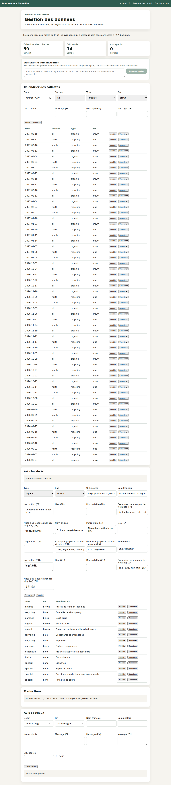
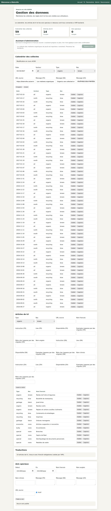

# Editing in the admin console

An administrator could create a collection, a sorting item or a notice, and
delete one. There was no way to correct one. The backend had supported
`PUT /{id}` on all three from the start, so the gap was entirely in the
browser: the panels wired up create, list and delete and stopped there.

## Why this was not simply "add a form"

The sorting item is the one that mattered. `V10`/`V11` moved two fields out of
a static TypeScript file and into the database - the short per-language
examples under each card, and the seasonal availability wording. The admin
console's model of a translation predated them and had three fields where the
API has five.

A naive edit form would have loaded the three it knew about and sent those
three back. `SortingItemService.update` replaces a translation wholesale, so
the first edit of any card would have silently emptied its examples and
blanked its seasonal wording - recreating, from the other direction, exactly
the split those two migrations existed to end.

So the fix is the form carrying every field the API round-trips, in all three
languages, and the verification below is specifically about what survives an
edit rather than about what changes.

## What was verified, in a real browser, against the running stack

Driven with Playwright against the real backend and a real MySQL - no mocked
API, no intercepted requests.

### A sorting item keeps everything the edit did not touch

```text
BEFORE  id 1  "Restes de fruits et legumes"
        examples   [fruits, legumes, pain, pates, viande, poisson,
                    coquilles d'oeufs, cafe, the]
        keywords   [fruits, legumes]

FORM LOADED WITH
  source URL, name/instruction/location/availability/examples/keywords
  for FR, EN and ZH — 21 fields, every one populated from the API

AFTER   id 1  "Restes de fruits et legumes (verifie)"
        examples   [fruits, legumes, pain, pates, viande, poisson,
                    coquilles d'oeufs, cafe, the]     <- all nine survived
        keywords   [fruits, legumes]                  <- survived
        zh.name    unchanged                          <- survived

RESULT: edit applied, nothing else lost
```



*"Modification en cours #1" — the panel's own create form, holding a real row.
Every row in all three tables now carries Modifier beside Supprimer.*

### A collection can be moved without losing its note

The calendar rows generated from `collection_schedule_rule` arrive with
trilingual wording and a source URL on them. Moving a collection to another
date is the most likely real edit - a holiday shift - and it must not strip
them.

```text
FORM LOADED WITH  2027-03-18, all, organic, brown,
                  https://blainville.ca/services/...,
                  "Les matieres organiques sont collectees le jeudi..."
                  "Organics are collected on Thursday..."
                  "厨余和有机垃圾全市每周四收集。"

MOVED TO 2027-03-19, rows matching: 1

NOTE AFTER MOVE  fr: "Les matieres organiques sont collectees le jeudi..."
                 zh: "厨余和有机垃圾全市每周四收集。"
                 src: https://blainville.ca/services/...
```

Read back through `GET /api/admin/collections`, not from the page that wrote
it. Then moved back, so the database was left as it was found.



## Reproducing it

```bash
cd backend && mvn spring-boot:run          # with DB_*/REDIS_* set
cd frontend && npm run dev
node docs/verification/screenshot_admin_edit.mjs
node docs/verification/screenshot_admin_schedule_edit.mjs
```

Both scripts read `ADMIN_EMAIL` and `ADMIN_PASSWORD` from the environment and
put back whatever they changed.

## What is still missing

The schedule table lists every collection with no paging or date filter. That
was fine when the calendar was a short hand-written seed; now that it extends
itself to a rolling horizon it is around sixty rows. Usable, but it is the
next thing that panel needs.
